<center><font face="黑体" size=32>DOTween代码阅读笔记</font></center>


本文记录一下DOTween源码的阅读，简单来说DOTween是一款动画插件，源码地址https://github.com/Demigiant/dotween，相关介绍http://dotween.demigiant.com/。

文章分为以下几个部分：

- 静态扩展类，为unity原生组件增加DOTween动画功能
- DOTween中TweenerCore和Sequence对象的创建
- Tween对象
- IPlugOptions对象
- ITweenPlugin对象和缓动函数
- 再识DOTween。通过访问TweenManager
- TweenManager，管理播放相关
- Editor
- 一些建议

1. 静态扩展类相关

   DOTweenModuleUI.cs扩展UI相关组件，把他们接入DOTween。接入的UI组件

   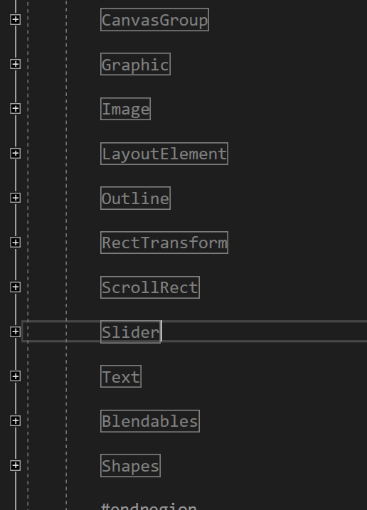

   以上UI的扩展函数原型基本都是，传入变换的UI组件，从当前值要变换到的目标值，以及此次变换时长，最终会返回TweenerCore或者Sequence对象，这是DOTween暴露给外部的两个对象，Tween内部动画<u>**对象的继承关系**</u>后续会详细说明。根据函数名称和传入参数能够很好的辨识出是对UI的哪个属性做变换，具体的属性可直接从UGUI源码里参考，如DOFade是对alpha做变换，DOColor是对组件的Color做变换。 Tweener(TweenerCore是对Tweener的一层继承封装)是运用到一个组件上的变换，而sequence是多个变换的集合或组合关系，内部可由多个tweener和sequence组成。函数内部通过DOTween.cs内部提供的方法创建Tweener和Sequence对象后，还设置了target即动画运用到的对象，但是其实不需要，代码里面也没有用到，因为已经通过getter，setter闭包引用到target了。

   具体相关UI组件支持的扩展方法可见附属**<u>UML图</u>**，这儿举两个例，DOColor、DOText和DOGradientColor。

   ```c#
   public static TweenerCore<Color, Color, ColorOptions> DOColor(this Image target, Color endValue, float duration)
   {
       TweenerCore<Color, Color, ColorOptions> t = DOTween.To(() => target.color, x => target.color = x, endValue, duration);
       t.SetTarget(target);
       return t;
   }
   ```

   DOColor通过DOTween暴露的接口创建TweenerCore对象，来将Image的颜色过度到endValue。

   ```c#
   public static TweenerCore<string, string, StringOptions> DOText(this Text target, string endValue, float duration, bool richTextEnabled = true, ScrambleMode scrambleMode = ScrambleMode.None, string scrambleChars = null)
   {
       ...
       TweenerCore<string, string, StringOptions> t = DOTween.To(() => target.text, x => target.text = x, endValue, duration);
       t.SetOptions(richTextEnabled, scrambleMode, scrambleChars)
           .SetTarget(target);
       return t;
   }
   ```

   DOText逐渐向当前文本的末尾追加字符串。

   ```c#
   public static Sequence DOGradientColor(this Image target, Gradient gradient, float duration)
   {
       Sequence s = DOTween.Sequence();
       GradientColorKey[] colors = gradient.colorKeys;
       int len = colors.Length;
       for (int i = 0; i < len; ++i) {
           GradientColorKey c = colors[i];
           if (i == 0 && c.time <= 0) {
               target.color = c.color;
               continue;
           }
           float colorDuration = i == len - 1
               ? duration - s.Duration(false) // Verifies that total duration is correct
               : duration * (i == 0 ? c.time : c.time - colors[i - 1].time);
           s.Append(target.DOColor(c.color, colorDuration).SetEase(Ease.Linear));
       }
       s.SetTarget(target);
       return s;
   }
   ```

   DOGradientColor通过Gradient颜色梯度信息来设置image的颜色，并把duration分摊到各个变化关键帧之间，由于梯度信息可以有很多个关键帧，即由很多段变换组成，所以是创建了一个sequence并为每一段变换创建tweener然后加入到sequence中。

   除了DOTweenModuleUI来扩展UI组件，还有DOTweenModuleAudio.cs、DOTweenModulePhysics.cs、DOTweenModulePhysics2D.cs、DOTweenModuleSprite.cs、DOTweenModuleUnityVersion.cs版本相关的功能扩展，DOTweenModuleUtils.cs版本无关的功能。用来扩展unity object或component的行为，本质上都是提供setter和getter供DOTween访问和设置相关属性，以及动画相关参数来创建动画，这儿不在详述。

   **总结：通过静态扩展类把DOTween动画接入UI原生组件，内部会构造TweenerCore和Sequence对象。同时引出了DOTween.cs，Sequence.cs和TweenerCore.cs**

2. TweenerCore和Sequence对象的创建

   上面提到通过扩展方法返回出来的是TweenerCore和sequence对象，也说明了是通过DOTween提供的接口来获取此对象。现在就进一步追溯以下核心动画对象的创建过程。

   从第一部分几段示例代码可以看出TweenerCore对象通过DOTween内部的To方法返回，传入的是相关属性的getter、setter和动画参数。To方法会根据传入参数提炼出相关模板，如getter、setter操作的属性类型，然后匹配上对应的To方法，同时也确定了TPlugOptions，通过TPlugOptions可以确定对应参数的插值器(插值器和setter、getter、TPlugOptions一一对应)，DOTween把这些插值器放在了Plugins namespace中。如通过getter、setter推断出操作的是color，那么就能够配置出选择的是ColorOptions。然后DOTween.cs内部通过ApplyTo真正的从**<u>TweenManager.cs</u>**获取对象后，调用Tweener.cs的接口Setup时会通过**<u>PluginsManager.cs</u>**获取对应的属性插值器，并初始化相关属性，初始化失败会马上把tweener对象返回给TweenManger。

   而Sequence的创建，是直接调用DOTween的Sequence方法获取的。同样最后都是从TweenManager中获取。

   **总结：通过DOTween，To方法获取TweenerCore，Sequence获取sequence。引出TweenManager.cs，PluginsManager.cs，Tweener.cs，TPlugOptions(所有的参数Option struce需要i实现的接口)，ITweenPlugin.cs(所有的属性插值器需要实现的接口)。这儿只是涉及到了DOTween创建TweenerCore和Sequence的职责，后续还会介绍他的其他功能。**

3. 前面提到过TweenCore、Sequence、Tweener、Tween几个相关类，现在就来梳理一下他们之间的关系。下面是一个UML图

   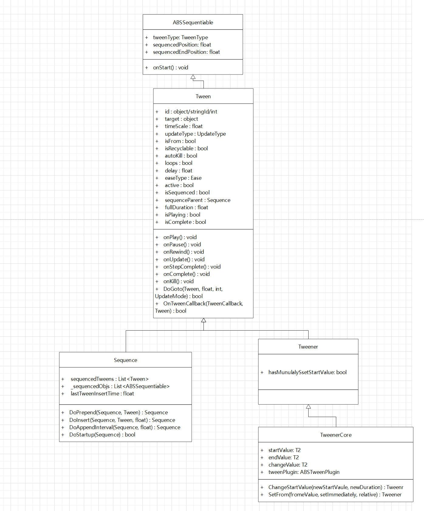

   Tween主要提供了一些setting、callback之类的，以及供外部调用static函数，如DoGoto，OnTweenCallback。而Sequence是Tween的集合，管理着内部的Tween，Tweener在Tween的基础上添加了一些行为，然后让TweenrCore实现。

   同时通过TweenSettingExtensions.cs扩展了Tween、Tweener、Sequence的行为，主要是提供设置内部属性的接口。通过**TweenExtensions.cs**把TweenerManager.cs内部的播放Tween相关的接口暴露了出来。

   主要介绍一下Sequence类，通过1中的例子我们看到，新建一个sequence后，通过append把tween加入到sequence中，而Append方法是通过上面说的扩展方法提供的，内部调用Sequence的DoInsert方法把Tween添加到Sequence中。首先把Tween从TweenManager的active list中移除，修改Tween的属性isSequenced，loops，sequenceParent等，并更新sequence的lastTweenInsertTime，sequence duration和sequencedEndPosition，最后插入到tween list中。DoPrepend是加载tween list最前面。

   **总结：简述了Tween相关的对象，以及用TweenSettingExtensions.cs提供访问Tween属性的接口，通过TweenExtensions.cs提供与Tween播放相关的接口，最终是通过调用TweenManager.cs内部的方法实现的。**

4. IPugOptions相关类。

   前面说到的TPlugOptions泛型参数就是实现了IPlugOptions的struct，这个参数提供给我们对插值属性的额外控制，如ColorOptions.cs可以通过设置alphaOnly来确定是否只对其中的alpha分量进行插值。

   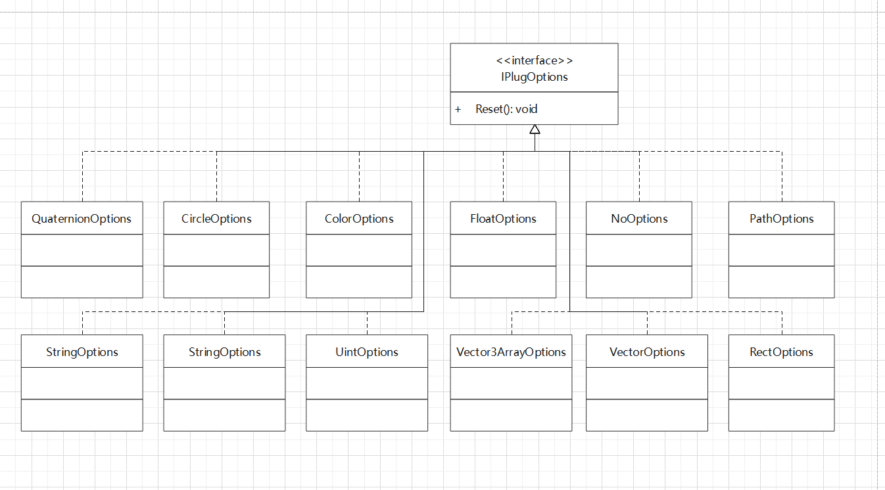

   如FloatPlugin会有snapping属性，以确定是否将float值round到int。TweenSettingsExtensions.cs中的扩展方法就有对该值的设定。

   ```c#
   public static Tweener SetOptions(this TweenerCore<float, float, FloatOptions> t, bool snapping)
   {
       if (t == null || !t.active) return t;
       t.plugOptions.snapping = snapping;
       return t;
   }
   ```

   **总结：IPlugOptions可以额外的提供对插值属性的约束。**

5. ITweenPlugin对象。

   前面提到过，所有的插值器都要实现ITweenPlugin接口，DOTween内部的相关类的UML图如下

   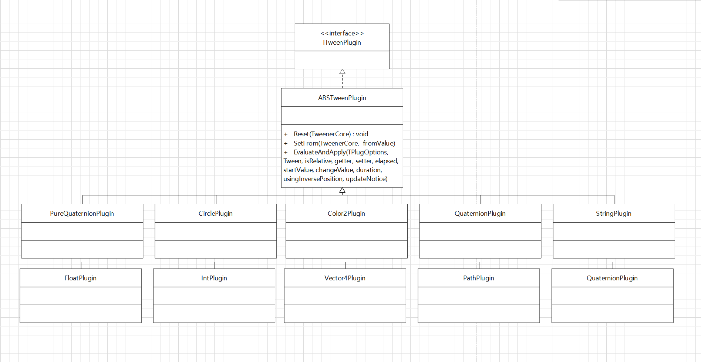

   TweenManager中对active tween list进行更新的时候，会调用Tween的静态方法**DoGoto**更新tween到指定的时间点，并触发对应的callback，内部调用特定类的**ApplyTween**实现，如TweenerCore的实现。

   ```c#
   internal override bool ApplyTween(float prevPosition, int prevCompletedLoops, int newCompletedSteps, bool useInversePosition, UpdateMode updateMode, UpdateNotice updateNotice)
   {
       if (isInverted) useInversePosition = !useInversePosition;
       float updatePosition = useInversePosition ? duration - position : position;
       ...
           tweenPlugin.EvaluateAndApply(plugOptions, this, isRelative, getter, setter, updatePosition, startValue, changeValue, duration, useInversePosition, updateNotice);
       ...
   }
   ```

   通过tweenPlugin的**EvaluateAndApply**得到当前时间属性的插值结果。我们具体的来看一下Color2Plugin.cs该函数的部分代码。

   ```c#
   float easeVal = EaseManager.Evaluate(t.easeType, t.customEase, elapsed, duration, t.easeOvershootOrAmplitude, t.easePeriod);
   if (!options.alphaOnly) {
       startValue.ca.r += changeValue.ca.r * easeVal;
       startValue.ca.g += changeValue.ca.g * easeVal;
       startValue.ca.b += changeValue.ca.b * easeVal;
       startValue.ca.a += changeValue.ca.a * easeVal;
       startValue.cb.r += changeValue.cb.r * easeVal;
       startValue.cb.g += changeValue.cb.g * easeVal;
       startValue.cb.b += changeValue.cb.b * easeVal;
       startValue.cb.a += changeValue.cb.a * easeVal;
       setter(startValue);
       return;
   }
   
   // Alpha only
   Color2 res = getter();
   res.ca.a = startValue.ca.a + changeValue.ca.a * easeVal;
   res.cb.a = startValue.cb.a + changeValue.cb.a * easeVal;
   setter(res);
   ```

   通过**EaseManager.cs**获取在duration内指定时间点elapsed的插值结果t，然后将t运用到属性上，最后通过setter设置属性的值。

   EaseManager.cs中的**Evaluate**是DOTween中最核心的函数，支持DOTween内部的插值方式以及用户自定义的插值函数，和unity的**animationcurve**结合也是很方便的。一个很不错的ease function参考网站https://easings.net/。内部支持

   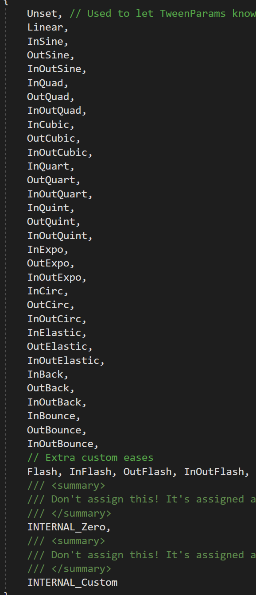

   TweenSettingsExtensions.cs中的SetEase函数就是设置ease函数的。

   ITweenPlugin通过**PluginsManager.cs**管理，内部是一堆lazy load的静态类，因为只是单纯的数值计算，而且是上下文无关的，所以是可以复用的。

   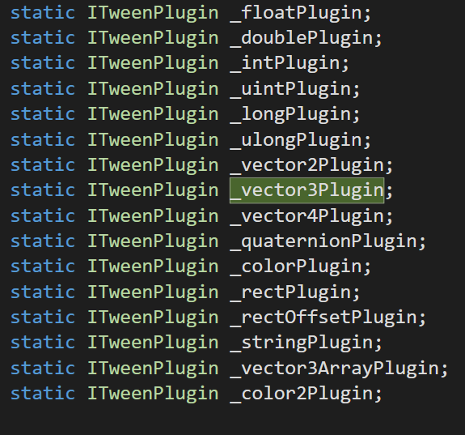

   **总结：通过ITweenPlugin来实现各种属性的插值，内部具体实现调用EaseManager中的Evaluate函数，支持内置缓动函数和用户自定义缓动函数。同时通过PluginsManager来管理所有的ITweenPlugin对象，达到单例和复用的效果。**

6. DOTween类提供较为丰富的功能，除了前面提到的创建TweenerCore和Sequence对象外，还有一些其他的功能值得介绍。

   - 设置TweenerManager的相关参数，如缓存池初始大小等，TweenerManager是通过static constructor来构造的，保证单例同时第一次使用到会自动构建。

   - 拉起整个DOTween环境，在首次创建Sequence和TweenerCore对象的时候，会**InitCheck**初始化Tween环境，主要是进入DOTweenComponent在scene场景中创建一个代理对象。

     ```c#
     GameObject go = new GameObject("[DOTween]");
     DontDestroyOnLoad(go);
     DOTween.instance = go.AddComponent<DOTweenComponent>();
     ```

     ​	**DOTweenComponent**主要是借用unity游戏循环驱动TweenManager更新，以及结合CustomYieldInstruction处理协程相关任务，如waitforkill，具体的**CustomYieldInstruction**在**DOTweenModuleUnityVersion**中实现。

   - 提供play operations相关接口，这儿提供对TweenManager中tween集合相关的播放处理，以及传入targetOrId进行单独的播放处理。

     ```c#
     /// <summary>Plays all tweens and returns the number of actual tweens played
             /// (meaning tweens that were not already playing or complete)</summary>
     public static int PlayAll()
     {
         return TweenManager.FilteredOperation(OperationType.Play, FilterType.All, null, false, 0);
     }
             /// <summary>Plays all tweens with the given ID or target and returns the number of actual tweens played
             /// (meaning the tweens that were not already playing or complete)</summary>
     public static int Play(object targetOrId)
     {
         if (targetOrId == null) return 0;
         return TweenManager.FilteredOperation(OperationType.Play, FilterType.TargetOrId, targetOrId, false, 0);
     }
     ```

     同时不要忘了，单个tween的播放控制已经通过**TweenExstions.cs**提供。

     ```c#
     public static T Play<T>(this T t) where T : Tween
     {
         ...
         TweenManager.Play(t);
         return t;
     }
     ```

     当然他们最后都是通过TweenManager来完成具体的功能。

     **总结：介绍了DOTween对环境的初始化，DOTweenComponent的功能，以及DOTween具备的play operation功能。**

7. TweenManager类，前面提到过那么多次TweenManager，可见该类的重要性，现在就来看看这个类的主要实现。

   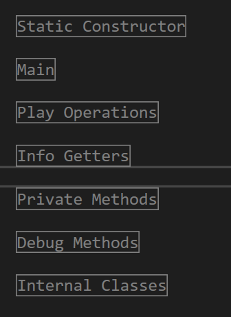

   我们主要关注Main和Play Operation，Main主要包含对Tween对象的管理和更新，而Play Operation主要提供给外部操作内部管理的Tween对象的接口。额外的还有一个looptype enum，指定循环的方式。

   ```c#
   /// <summary>Each loop cycle restarts from the beginning</summary>
   Restart,
   /// <summary>The tween moves forward and backwards at alternate cycles</summary>
   Yoyo,
   /// <summary>Continuously increments the tween at the end of each loop cycle (A to B, B to B+(A-B), and so on), thus always moving "onward".
   /// <para>In case of String tweens works only if the tween is set as relative</para></summary>
   Incremental
   ```

   - Main，首先TweenManager是一个Tween的管理类，用stack管理Sequence和用list管理Tweener，并记录分别记录了其中tweener和sequence的总数量，pool数量，active数量，还将他们分为不同更新模式，Default、Fixed、Late、Manual等。

     GetTweener获取一个TweenerCore，这个就是DOTween创建TweenerCore对象调用的方法，内部会根据pool里面数量是否足够确定是新建还是从pool里面复用，同时根据参数进行匹配，获得一个Tweener，然后AddActiveTween加入到active列表里面。另一个方法GetSequence类似，是获取一个Sequence。Despawn返还一个Tween，DespawnAll返还所有Tween。PurgeAll删除所有active的Tween，并且把Pool里面的Tweenr和Sequence删除。

     注意到由两个新方法，AddTweenLink和RemoveTweenLink，上层对应SetLink函数，这两个函数的作用是把Tween绑定到GameObject，并对GameObject的行为做出响应，内部会用一个Dictionary来维护。

     Update方法是驱动Tween更新的入口，需要将时间相关信息传入，分update类型分别对active tween进行更新，并记录要kill的tween。具体的Update首先根据link的对象更新tween的状态，会根据pass的时间做一定的处理丢弃，比如时间较短就不更新，最后是将所有的active list中的tween调用DOGoto方法完成tween的更新(没有做单帧数量上限)。

     FilteredOperation，是提供给上层DOTween播放Tween能力的接口，通过FilterType来从active list中找出符合的tween，然后赋予OperationType指定的操作。

     ```c#
     internal enum FilterType
     {
     All,
     TargetOrId, // Check both for id and target
     TargetAndId, // Check for both id and target on the same tween
     AllExceptTargetsOrIds, // Excludes given targets or ids
     DOGetter
     }
     ```

     ```c#
     internal enum OperationType
     {
     Complete,
     Despawn,
     Flip,
     Goto,
     Pause,
     Play,
     PlayForward,
     PlayBackwards,
     Rewind,
     SmoothRewind,
     Restart,
     TogglePause,
     IsTweening
     }
     ```

   - Play Operations，主要赋予Tween播放的能力。

     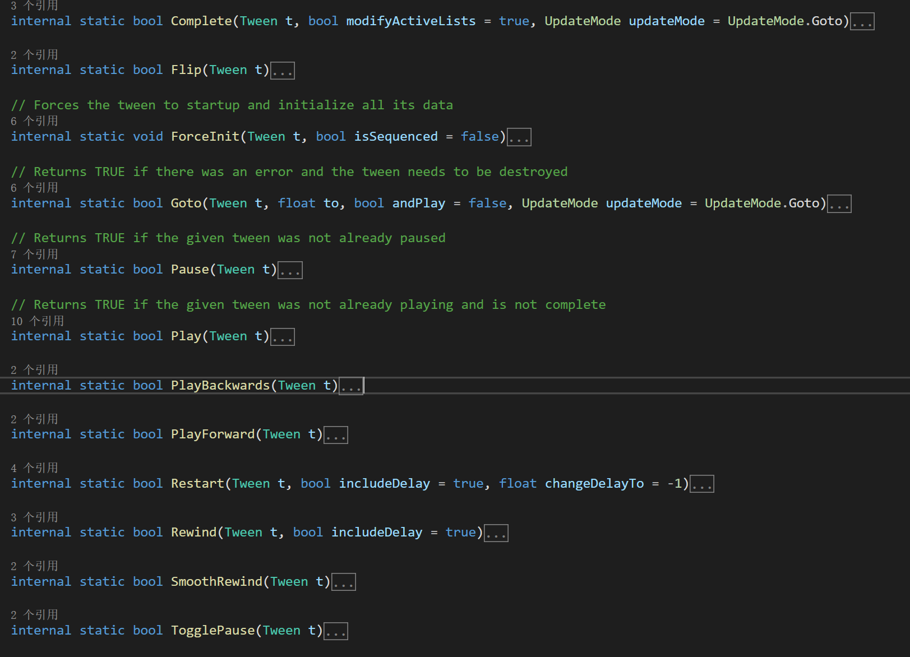

     TweenExtensions的底层接口就是这些函数。我们直接对创建的Tween进行的操作就是这些函数提供的，所以会详细的介绍一下这些函数。
     
     - [x] Complete
     
       ```c#
       if (t.loops == -1) return false;
       ...
       Tween.DoGoto(t, t.duration, t.loops, updateMode);
       ...
       ```
     
       可以看到Complete是直接goto到tween的末尾，如果是autoKill还会把该Tween归还给TweenManager。
     
     - [x] Flip
     
       ```c#
       t.isBackwards = !t.isBackwards;
       ```
     
       翻转Tween正反播放顺序，在TweenManager update对应的tween的时候，会根据该标签设置Goto到的position。
     
     - [x] ForceInit
     
       ```c#
       t.Startup()
       ...
       //sequence
       StableSortSequencedObjs(s._sequencedObjs);
       ...
       s.sequencedTweens[i].isRelative = true;
       ...
       TweenManager.Goto(t, t.duration * t.loops, false, UpdateMode.IgnoreOnComplete);
       ...
       //tweener
       if (t.isFrom)
       {
               // From tween without forced From value and where setImmediately was FALSE
               // (contrary to other forms of From tweens its values will be set at startup)
               t.SetFrom(t.isRelative && !t.isBlendable);
               t.isRelative = false;
           }
       else 
           t.startValue = t.tweenPlugin.ConvertToStartValue(t, t.getter());
       if (t.isRelative) 
           t.tweenPlugin.SetRelativeEndValue(t);
       
       ```
     
       ForceInit主要就是初始化Tween，最终都是调用对应的DoStartup方法。sequence会对应所有的tween根据start position进行排序，然后逐一设置isInverted，**isRelative**等属性。而Tweenr是主要要设置startValue，如果是isFrom即从设定值到当前target的目标只变换，这个时候要将target初始化为设定的from value，并把当前的end value设置为to，同时会根据isRelative调整end value，relative是相对，意思是在当前的基础上叠加的变换，而不是直接将结果运用到target上。Color2Plygin中的SetFrom
     
       ```c#
       public override void SetFrom(TweenerCore<Color2, Color2, ColorOptions> t, Color2 fromValue, bool setImmediately, bool isRelative)
       {
           if (isRelative) {
               Color2 currVal = t.getter();
               t.endValue += currVal;
               fromValue += currVal;
           }
           t.startValue = fromValue;
           if (setImmediately) {
               Color2 to = fromValue;
               if (t.plugOptions.alphaOnly) {
                   to = t.getter();
                   to.ca.a = fromValue.ca.a;
                   to.cb.a = fromValue.cb.a;
               }
           	t.setter(to);
           }
       }
       ```
     
       
     
     - [x] Goto
     
       Goto直接将Tween跳转到时间轴上某个位置，并且还有一个额外的参数andPlay确定跳转过去是直接播放还是暂停。
     
       ```c#
       Tween.DoGoto(t, toPosition, toCompletedLoops, updateMode);
       if (!andPlay && wasPlaying && !needsKilling && t.onPause != null) 			Tween.OnTweenCallback(t.onPause, t);
       ```
     
     - [x] Pause
     
       设置isPlaying标签，并触发对应的onPause回调，TweenManager update会跳过isPlaying为false 的Tween。
     
     - [x] Play
     
       与Pause相对，设置isPlaying标签和触发回调。
     
     - [x] PalyBackwards
     
       设置isBackwards标签，标识为倒放，不会重复设置，然后调用Play。
     
       ```c#
       if (!t.isBackwards) {
           t.isBackwards = true;
           Play(t);
           return true;
       }
       return Play(t);
       ```
     
     - [x] PalyForward
     
       与PlayBackWards相对，设置isBackwards标签，让tween正向播放。
     
     - [x] Restart
     
       从头开始播放，内部调用Rewind，然后设置isPlaying标签。
     
     - [x] Rewind
     
       将Tween goto到时间轴起始位置。
     
     - [x] SmoothRewind
     
       不会直接回到起始位置，是回到某个位置然后PlayBackwards。
     
     - [x] TooglePause
     
       在暂停和播放之间切换。
     
     **总结：介绍了核心管理类TweenManager。**

8. editor面板。

   DOTween的核心代码部分基本，现在来看看DOTweenPro配套的editor。	UML图如下

   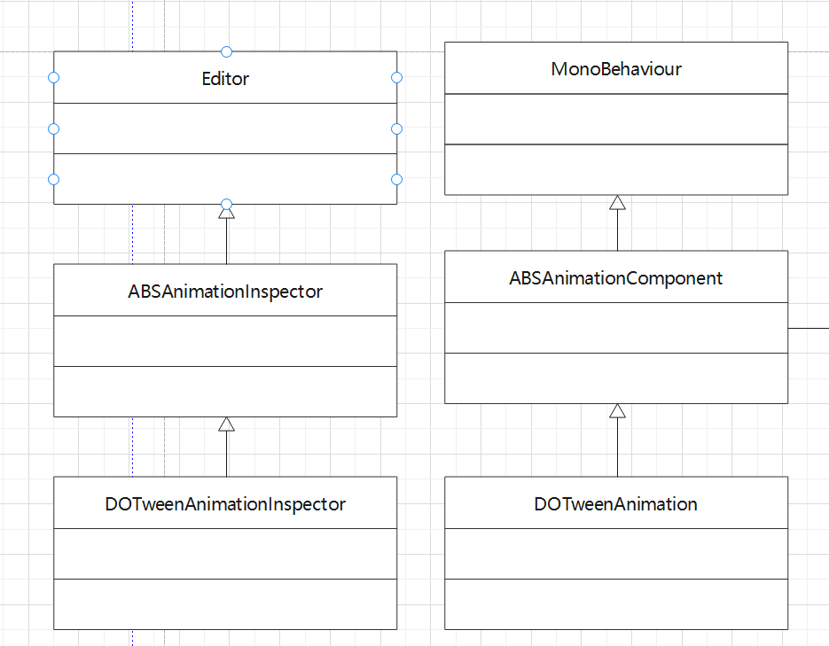

   把Tween的部分属性暴露出来编辑，也就是调用TweenSettingsExtension里面暴露出来的接口。如编辑各种事件。DOTweenAnimation具有一堆可序列化的Tween相关的属性，内部通过CreateTween来创建，配套的Inspector上进行的各种操作都是在修改这些属性。创建Tween对象的时候可以设置target，target可以和getter和setter的目标不一样，这样和前面提到的DOTween用targetId来操作指定的Tween对应上。同时表明前面理解错了，target是有用的，虽然很多时候target和getter、setter的对象是相同的。

   然后我们来看看面板的具体组成：

   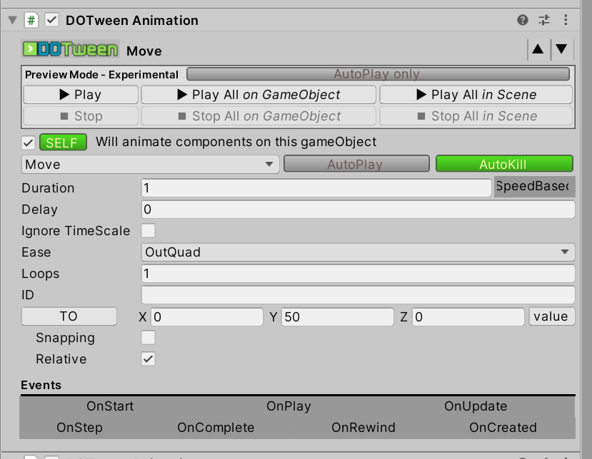

   主要分为预览，动画类型设置，相关参数设置，事件设置，以及AutoPlay和AutoKill。AutoPlay在gameobject实例化出来后通过Start方法调用CreateTween把Tween创建出来后就会播放。autokill会设置tween对应的flag，让tween播放完后自动销毁。

   同时还有一个对DOTween全局的设置面板：

   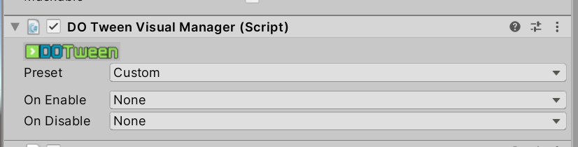

   可以通过present设置是否启用pool，以及该component enable和disable的时候，是play、restart；还是pause、kill之类的。注意该面板只管理该target下的所有的tween，不包含child节点下的tween。

   **总结：介绍了DOTween editor面板。**

9. 一些建议

   - 最好开启pool，避免频繁的GC。同时限制游戏中同时存在的tween动画上限，对tween动画的更新做分帧或做优先级处理。
   - 使用editor时，如果tween动画和gameobject的生命周期绑定就不要勾选autokill，该tween在对象生命周期可以反复使用，否则就勾上比如只需要对象实例化出来调用一次的动画。
   - 希望反复播放的就不要勾选AutoPlay了，因为他只会播一次，可以代码控制播放，或者DOTweenVisualManager控制播放。

