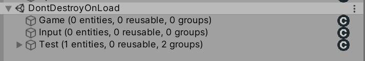
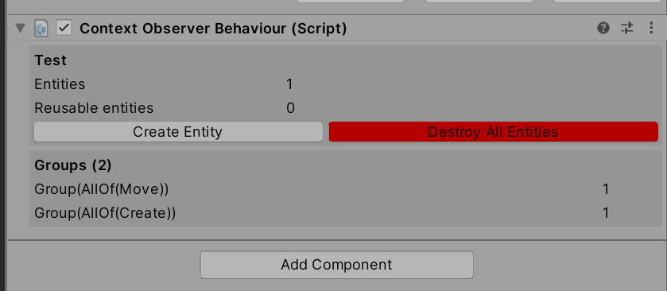
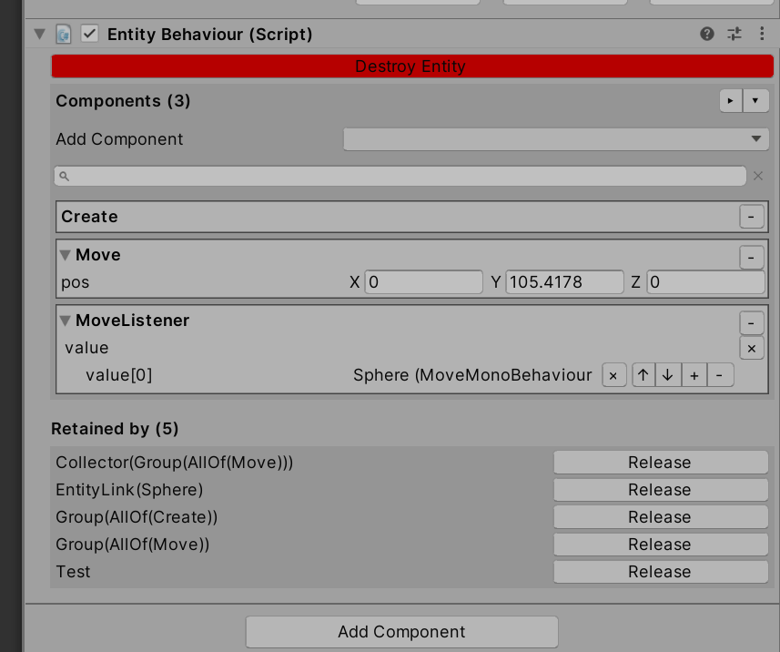
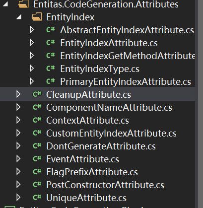
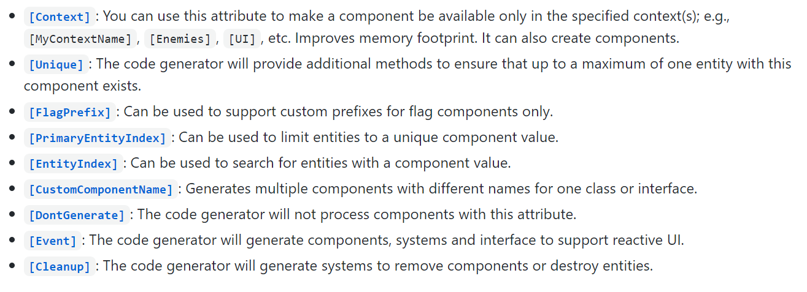
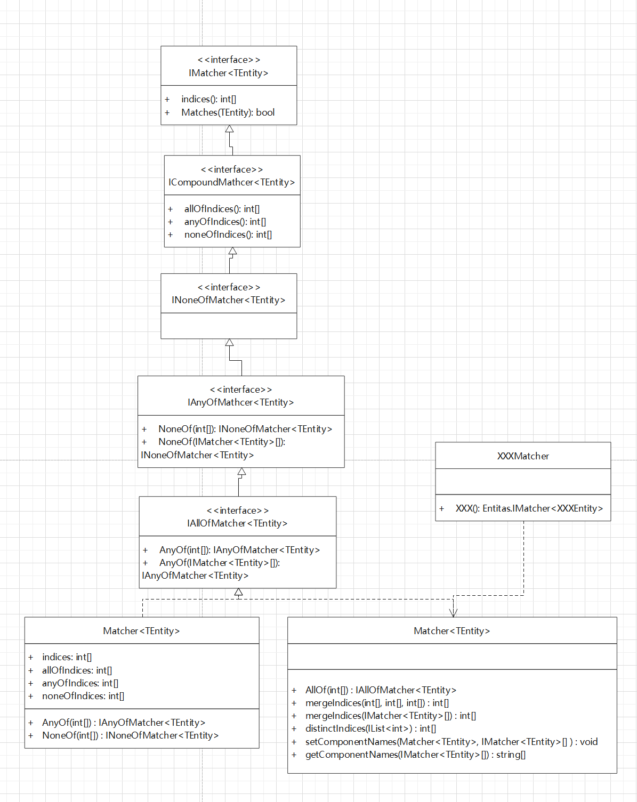

> <center><font face="黑体" size=32>Entitas源码阅读</font></center>

[TOC]

##### Contexts

**Contexts**是生成的管理游戏中所有context的类-拥有唯一静态实例sharedInstance，表示希望我们以单例的方式使用该类，但是并没有从代码上阻止我们实例化的可能性。该类继承自**IContexts**并实现allContexts方法返回context列表，同时为每个context都生成了对应的property供外部访问。

生成了两个部分类，一个是管理所有context的管理类，负责构造和reset所有的context，同时会调用contexts中被**PostConstructor**标注的方法。该方法在另一个部分类中，该类的方法在DEBUG模式下会生效，主要是为每个context CreateContextObserver来创建一个观察者**ContextObserver**。

ContextObserver内部会持有context，group，并新建一个对应system名字的gameobject，挂上**ContextObserverBehaviour**脚本，在context注册对应的OnEntityCreate和OnGroupCreated回调，每创建一个Entity都会在gameobject下生成一个子物体，并挂上脚本**EntityBehaviour**，重写了ToString方法，会把context中当前entity、缓存entity、被引用或被持有的数量打印出来，并且会把所有的group列出来。会把简略的信息赋值给尕meobject的name，同时通过对应的**ContextObserverInspecctor**会在Inspector中显示更详细的信息。





前面提到会为每个生成的entity在context下生成对应的debug gameobject并挂上EntityBehaviour组件。entitybehaviour中持有对应的entity和context，同时也有维护的所有EntityBehaviour的pool的引用，以便在监听到对应entity release的时候把自己入池。同样通过**EntityInspector**可以debug详细信息。




除了初始化debug信息外，Post标签还标注了InitializeEntityIndices方法，该方法会初始化用于维护context中被**PrimaryEntityIndex**和**EntityIndex**的容器，被PrimaryEntityIndex标识的属性表明在context属性值是唯一的，所以可以用来作为key进行查找，而被EntityIndex标识的属性表明值可以重复。context内部会维护属性name->IEntityIndex的字典，PrimaryEntityIndex和EntityIndex都继承了IEntityIndex，PrimaryEntityIndex内部维护了一个keyValue->entity的字典，而EntityIndex内部维护了keyValue->hashset<entity>。通过context内部维护额外的数据结构，可以加快我们通过指定标签属性索引的entity的速度。

为了方便我们查询还会生成对应的扩展方法类**ContextsExtensions**，如一个component中有多个属性被标识了PrimaryEntityIndex会生成GetEntityWithMultiplePrimaryEntityIndicesXXX，如被EntityIndex标识生成GetEntitiesWithXXXEntityIndex。index支持多key匹配如中文名和英文名都是唯一的，可以把这两个值放在一个index里面。

**总结：contexts维护所有的context，并初始化context的debug和index property信息。**

##### Context

前面说到contexts管理所有的context，现在就开始解析context相关的代码。每个我们声明的context都会生成对应的XXXContext继承Context<XXXEntity>，表明该context是用来管理XXXEntity的，其中会生成对应的构造方法，其中会有重要的entity的模板，也就是告诉context自己所有的component的name和type以及index，和构造自己的工厂方法，以及引用计数模式。如：

```c#
public GameContext(): base( GameComponentsLookup.TotalComponents, 0,
            new Entitas.ContextInfo(
                "Game",
                GameComponentsLookup.componentNames,
                GameComponentsLookup.componentTypes
            ),
            (entity) =>
#if (ENTITAS_FAST_AND_UNSAFE)
                new Entitas.UnsafeAERC(),
#else
                new Entitas.SafeAERC(entity),
#endif
            () => new GameEntity())
```

除了该类外，还会生成一些其他的部分类。如用**Unique**标识的component标识只有一个entity持有改component实例，所以可以通过context直接索引到持有该entity的实例，会生成一个对应的部分类，会为该component生成对应的Group来收集持有该component的entity以及其他相关操作。如：

```c#
public GameEntity animatingEntity { get { return GetGroup(GameMatcher.Animating).GetSingleEntity(); } }

    public bool isAnimating {
        get { return animatingEntity != null; }
        set {
            var entity = animatingEntity;
            if (value != (entity != null)) {
                if (value) 
                    CreateEntity().isAnimating = true;
                 else 
                    entity.Destroy();
            }
        }
    }
```

所有的context继承自Context<TEntity>，而Context<TEntity>实现了IContext<TEntity>，IContext<TEntity>继承了IContext。好我们来介绍一下接口中的规范，IContext规范了Context需要实现的功能。

1. 暴露给外部注册监听context变化。如Entity的Created和Destroyed和WillBeDestroyed，以及Group的Created监听。
2. 需要持有entity模板相关的信息，如totalComponents，**ContextInfo**。内部entity数量信息的维护，entity的创建和销毁接口。
3. Group的创建接口。
4. Component缓存相关。

其中ContexInfo中指明了entity模板的component组成。

```c#
public readonly string name;
public readonly string[] componentNames;
public readonly Type[] componentTypes;
```

OK，来看一下具体的context实现。首先是暴露给外部监听context变化的相关接口，在对应的逻辑发生的时候就会对相关event进行调用：

```c#
public event ContextEntityChanged OnEntityCreated;
public event ContextEntityChanged OnEntityWillBeDestroyed;
public event ContextEntityChanged OnEntityDestroyed;
public event ContextGroupChanged OnGroupCreated;
```

然后是context需要监听的事件，主要是需要监听entity的变化，所以在entity创建出来后就会在entity上面绑定相关方法：

```c#
entity.OnComponentAdded += _cachedEntityChanged;
entity.OnComponentRemoved += _cachedEntityChanged;
entity.OnComponentReplaced += _cachedComponentReplaced;
entity.OnEntityReleased += _cachedEntityReleased;
entity.OnDestroyEntity += _cachedDestroyEntity;
```

注意这儿注册用的委托链的方式，并且没有直接+=function，这是为了**避免每次+=的时候隐式构造委托对象**，所以事先cache了：

```c#
readonly EntityComponentChanged _cachedEntityChanged;
readonly EntityComponentReplaced _cachedComponentReplaced;
readonly EntityEvent _cachedEntityReleased;
readonly EntityEvent _cachedDestroyEntity;
```

```c#
readonly Stack<IComponent>[] _componentPools;
readonly ContextInfo _contextInfo;
readonly Func<IEntity, IAERC> _aercFactory;
readonly Func<TEntity> _entityFactory;
readonly HashSet<TEntity> _entities = new HashSet<TEntity>(EntityEqualityComparer<TEntity>.comparer);
readonly Stack<TEntity> _reusableEntities = new Stack<TEntity>();
readonly HashSet<TEntity> _retainedEntities = new HashSet<TEntity>(EntityEqualityComparer<TEntity>.comparer);
readonly Dictionary<IMatcher<TEntity>, IGroup<TEntity>> _groups = new Dictionary<IMatcher<TEntity>, IGroup<TEntity>>();
readonly List<IGroup<TEntity>>[] _groupsForIndex;
readonly ObjectPool<List<GroupChanged<TEntity>>> _groupChangedListPool;
readonly Dictionary<string, IEntityIndex> _entityIndices;
```

上面这段代码就是context内部状态的相关维护，如entity工厂函数，aerc工厂函数，component缓存，entity缓存和维护，**group**的维护，以及我们前面提到的IEntityIndex的维护。

下面介绍context的几个关键函数：

- 构造函数。

```c#
_aercFactory = aercFactory ?? (entity => new SafeAERC(entity));
_entityFactory = entityFactory;

_groupsForIndex = new List<IGroup<TEntity>>[totalComponents];
_componentPools = new Stack<IComponent>[totalComponents];
_entityIndices = new Dictionary<string, IEntityIndex>();

_cachedEntityChanged = updateGroupsComponentAddedOrRemoved;
_cachedComponentReplaced = updateGroupsComponentReplaced;
_cachedEntityReleased = onEntityReleased;
_cachedDestroyEntity = onDestroyEntity;
```

主要初始化工厂函数，创建compopnent pool，component group，并默认建立好了与component的映射关系，通过下标访问。并cache了对entity的委托对象。

- CreateEntity函数。

  ```c#
  if (_reusableEntities.Count > 0) {
      entity = _reusableEntities.Pop();
      entity.Reactivate(_creationIndex++);
  } else {
      entity = _entityFactory();
      entity.Initialize();
  }
  
  _entities.Add(entity);
  entity.Retain(this);
  
  entity.OnComponentAdded += _cachedEntityChanged;
  entity.OnComponentRemoved += _cachedEntityChanged;
  entity.OnComponentReplaced += _cachedComponentReplaced;
  entity.OnEntityReleased += _cachedEntityReleased;
  entity.OnDestroyEntity += _cachedDestroyEntity;
  ...
  OnEntityCreated(this, entity);
  ```

  创建一个entity，首先从pool里面拿，没有就通过工厂函数创建，处理引用计数，并对该entity注册相关回调，最后触发**外部系统**对context entity create注册的回调。

- GetGroup函数。

  ```c#
  if (!_groups.TryGetValue(matcher, out group)) {
      group = new Group<TEntity>(matcher);
      var entities = GetEntities();
      for (int i = 0; i < entities.Length; i++)
      	group.HandleEntitySilently(entities[i]);
  	_groups.Add(matcher, group);
  
      for (int i = 0; i < matcher.indices.Length; i++) {
          var index = matcher.indices[i];
          if (_groupsForIndex[index] == null)
              _groupsForIndex[index] = new List<IGroup<TEntity>>();
  
          _groupsForIndex[index].Add(group);
      }
  
      if (OnGroupCreated != null)
      	OnGroupCreated(this, group);
  }
  ```

  为**matcher**创建对应的group，并把匹配的entity加入进去，同时还需要更新维护的每个component被哪些group关注的信息。同样最后触发外部系统回调。

- AddEntityIndex、GetEntityIndex函数。处理我们前面提到的index相关标签。

- Reset函数。清理所有的active的entity，注意不会把缓存清空，只是把所有的entity destroy掉。

- updateGroupsComponentAddedOrRemoved函数。注册到entity身上用来监听entity上component的添加和删除，因为这会引起group的变化。该函数在entity调用**AddComponent**和**RemoveComponent**成功以及**ReplacceComponent**导致component变化(如用非null替换null和null替换非null)时触发。所以该方法的cache叫cachedEntityChanged，因为这个时候real components已经变化了，所以entity的含义或抽象是改变了的。

  ```c#
  for (int i = 0; i < groups.Count; i++)
      events.Add(groups[i].HandleEntity(tEntity));
  ```

  所以主要是找到关注该component的group然后调用**HandleEntity**。

- updateGroupsComponentReplaced函数，这是component被replace同时不导致entity发生改变的时候调用。

  ```c#
  groups[i].UpdateEntity(tEntity, index, previousComponent, newComponent)
  ```

  主要是调用了group的**UpdateEntity**。

- onEntityReleased、onDestroyEntity函数，**destroy** entity的时候会调用OnDestroyEntity，主要是从active的entity中移除，然后调用entity的**InternalDestroy**，清理掉components和绑定的事件，最后如果引用计数为1，就**release**掉entity，release会再次判断引用计数为0，是就会触发OnEntityReleased把entity放回缓存中。过程中会触发外部系统对destroy的回调。

  ```c#
  var removed = _entities.Remove(tEntity);
  ...
  OnEntityWillBeDestroyed(this, tEntity);
  ...
  tEntity.InternalDestroy();
  ...
  OnEntityDestroyed(this, tEntity);
  ...
  if (tEntity.retainCount == 1) {
      tEntity.OnEntityReleased -= _cachedEntityReleased;
      _reusableEntities.Push(tEntity);
      tEntity.Release(this);
      tEntity.RemoveAllOnEntityReleasedHandlers();
  } else {
      _retainedEntities.Add(tEntity);
      tEntity.Release(this);
  }
  ```

  ```c#
  var tEntity = (TEntity)entity;
  entity.RemoveAllOnEntityReleasedHandlers();
  _retainedEntities.Remove(tEntity);
  _reusableEntities.Push(tEntity);
  ```

此外，ContextExtension中提供了context的扩展方法**GetEntities**和**CloneEntity**。

**总结：context维护entity和一些关注entity的组件，如group，entityIndex等，并维护相关缓存。监听entity的变化，并且触发外部系统对entity或自己的关注。**

##### Enitity&Component

前面讲了管理entity的context，现在就来看看entity的相关代码。

entity的模板有component定义，所以生成entity相关代码的时候，会为每个component生成对应的部分类，其中包含着与该component相关的操作，如AddXXX、ReplaceXXX、RemoveXXX，isXXX，hasXXX以及直接获取XXX，需要注意的是直接获取XXX内部会判断hasXXX，如果没有的话会抛出异常也不会返回null。

```c#
public ColorComponent color { get { return (ColorComponent)GetComponent(TestComponentsLookup.Color); } }
public bool hasColor { get { return HasComponent(TestComponentsLookup.Color); } }

public void AddColor(System.Drawing.Color newColor) {
    var index = TestComponentsLookup.Color;
    var component = (ColorComponent)CreateComponent(index, typeof(ColorComponent));
    component.color = newColor;
    AddComponent(index, component);
}

public void ReplaceColor(System.Drawing.Color newColor) {
    var index = TestComponentsLookup.Color;
    var component = (ColorComponent)CreateComponent(index, typeof(ColorComponent));
    component.color = newColor;
    ReplaceComponent(index, component);
}

public void RemoveColor() {
	RemoveComponent(TestComponentsLookup.Color);
}
```

还会生成一个**XXXComponentsLookup**标识了entity的component构成，通过预定义的component的index索引效率较高。

```c#
public const int Color = 0;
public const int Create = 1;

public static readonly string[] componentNames = {
    "Color",
    "Create",
};

public static readonly System.Type[] componentTypes = {
    typeof(ColorComponent),
    typeof(CreateComponent),
};
```

还会为每个component生成匹配的**matcher**，用于我们能够在context中筛选出相关的entity。

```c#
var matcher = (Entitas.Matcher<TestEntity>)Entitas.Matcher<TestEntity>.AllOf(TestComponentsLookup.Create);
matcher.componentNames = TestComponentsLookup.componentNames;
```

还会生成组合component的matcher，用于筛选多个component的组合。

```c#
public static Entitas.IAllOfMatcher<TestEntity> AllOf(params int[] indices) {
	return Entitas.Matcher<TestEntity>.AllOf(indices);
}

public static Entitas.IAllOfMatcher<TestEntity> AllOf(params Entitas.IMatcher<TestEntity>[] matchers) {
	return Entitas.Matcher<TestEntity>.AllOf(matchers);
}

public static Entitas.IAnyOfMatcher<TestEntity> AnyOf(params int[] indices) {
	return Entitas.Matcher<TestEntity>.AnyOf(indices);
}

public static Entitas.IAnyOfMatcher<TestEntity> AnyOf(params Entitas.IMatcher<TestEntity>[] matchers) {
	return Entitas.Matcher<TestEntity>.AnyOf(matchers);
}
```

entity可能会包含额外的component，如我们需要监听某个component中内容的变化，通过**collector**是行不通的，所以会用**Event**标签标识component，这个时候会生成额外的监听该component的**XXXListenerComponent**，其中会维护一个IXXXListener对象列表，所有要监听component内容变化的对象都要实现IXXXListener接口并实现对应的方法。同时还会生成一个ReactiveSystem<XXXEntity>收集对应component的变化并调用listener中注册的监听者实现的接口方法。

```c#
_listenerBuffer.AddRange(e.moveListener.value);
foreach (var listener in _listenerBuffer) {
	listener.OnMove(e, component.pos);
}
```

同时为了引用entity，还可以通过EntityLink来持有对应的entity。

Entity实现IEntity接口，IEntity接口继承IAERC接口。这就决定了entity需要维护自己的引用计数，并且要提供IEntity接口中定义的entity相关的基本操作。所以entity主要功能如下：

- 外部注册的事件回调。提供给外部系统，主要是context监听entity内部状态变化的接口。

  ```c#
  public event EntityComponentChanged OnComponentAdded;
  public event EntityComponentChanged OnComponentRemoved;
  public event EntityComponentReplaced OnComponentReplaced;
  public event EntityEvent OnEntityReleased;
  npublic event EntityEvent OnDestroyEntity;
  ```

  OnComponentAdded在显示调用AddComponent成功或者ReplaceComponent时原来的component为null时调用。

  OnComponentRemoved相对，在RemoveComponent，内部会使用null调用ReplaceComponent方法，或者直接用null调用replaceComponent方法成功时调用。

  OnComponentReplaced是在，component存在，并且用一个非null的component进行replace进行调用。

  OnEntityReleased在entity的引用计数为0时，要真正回收entity了，进行调用。

  OnDestroyEntity在显示调用entity Destroy的时候调用，这个时候会把entity isEnable设置为false，remove掉所有的component，清掉除开release之外所有的回调。但是entity不一定能立即回收，因为可能还有其他系统引用着该entity。当引用计数为0时，真正的回收entity，并把release回调清空。

- entity创建销毁。主要是初始化和激活entity。

  ```c#
  public void Initialize(int creationIndex, int totalComponents, Stack<IComponent>[] componentPools, ContextInfo contextInfo = null, IAERC aerc = null) {
      Reactivate(creationIndex);
      _totalComponents = totalComponents;
      _components = new IComponent[totalComponents];
      _componentPools = componentPools;
      _contextInfo = contextInfo ?? createDefaultContextInfo();
      _aerc = aerc ?? new SafeAERC(this);
  }
  ```

  构造entity之后需要initialize entity，初始化entity原型相关信息。如果是复用缓存中的entity就需要重新激活。

  ```c#
  public void Reactivate(int creationIndex) {
      _creationIndex = creationIndex;
      _isEnabled = true;
  }
  ```

  可以看到每个entity都具有一个createIndex，这个还是挺重要的，在对应的**EntityEqualityComparer**中就是使用改值作为hash值的。

  销毁就是上面提到的，Destroy和Release函数。

  ```c#
  public void Destroy() {
      if (!_isEnabled)
          throw new EntityIsNotEnabledException("Cannot destroy " + this + "!");
      if (OnDestroyEntity != null)
          OnDestroyEntity(this);
  }
  ```

  可以看到会调用OnDestroyEntity回调，在context中注册了对应的回调，从active entity列表中移除，然后调用外部系统对context **OnEntityWillBeDestroyed**的回调，然后调用entity的**InternalDestroy**并触发context **OnEntityDestroyed**，然后减对应的引用计数，判断是否可以release并调用。如果entity还被引用，会被放入retainedEntities里面，如果没被引用，release的时候会被放入reusableEntities中。

  ```c#
  public void InternalDestroy() {
      _isEnabled = false;
      RemoveAllComponents();
      OnComponentAdded = null;
      OnComponentReplaced = null;
      OnComponentRemoved = null;
      OnDestroyEntity = null;
  }
  ```

  InternalDestroy中会清除所有的component和一些回调。

  ```c#
  public void Release(object owner) {
      _aerc.Release(owner);
      if (_aerc.retainCount == 0)
          if (OnEntityReleased != null) 
          	OnEntityReleased(this);
  }
  ```

  release的时候调用context中的回调，真正的回收entity。

- component相关操作。主要就是component的增删查改，注意会对对应的监听进行回调。

- ToString。打印出，entity的详细信息，name，component等。

component相对而言就比较简单了，因为主要都是代码生成的，唯一的要求就是所有的component都需要实现IComponent接口。接下来就是熟悉component相关的attribute的功能。



可以看到attribute还挺多的，具体功能可以参考。



**总结，entity主要包含了组成自己相关的compoennt的管理，自己的生命周期管理，以及触发相关的外部监听。**

##### Group、Matcher、Collector

前面数次提到Group、Matcher、Collector的概念，现在就来认识一下他们。

Matcher，之前提到代码生成的时候，会为对应的component生成一个MatherXXX，并且生成过滤component组合的AllOf、AnyOf方法。最终都是构造了一个Matcher<XXXEntity>实例。



上面是matcher的类图，IMatcher定义了匹配的indices和matcher要实现的匹配函数，而ICompoundMatcher根据需求细分了一下matcher，如allOf是表明要完全匹配所有的indices才算满足条件，anyOfIndices只要一个indices匹配就算满足，noneOf是一个indices都匹配才满足条件。

OK，现在来看看matcher的具体实现。matcher由四个部分类组成，上面只标出了两个，MatcherEquals中定义Equals判断和hashCode生成。hash算法如下，本质还是异或：

```c#
if (!_isHashCached) {
    var hash = GetType().GetHashCode();
    hash = applyHash(hash, _allOfIndices, 3, 53);
    hash = applyHash(hash, _anyOfIndices, 307, 367);
    hash = applyHash(hash, _noneOfIndices, 647, 683);
    _hash = hash;
    _isHashCached = true;
}
...
static int applyHash(int hash, int[] indices, int i1, int i2) {
    if (indices != null) {
        for (int i = 0; i < indices.Length; i++) {
            hash ^= indices[i] * i1;
        hash ^= indices.Length * i2;
    return hash;
}
```

MatcherToString中重写ToString方法，可以把Matcher中allOf、anyOf、noneOf中关注的component打印出来。

MatcherStatic中定义static方法，用其中提供的Allof、AnyOf可创建出对应的matcher。mergeIndices可以将matcher关注的所有的component index合并。但是可能存在重复，distinctIndices就是用来去重并重新排序的，主要是通过一个hashset来去重：

```c#
foreach (var index in indices) 
	_indexSetBuffer.Add(index);
var uniqueIndices = new int[_indexSetBuffer.Count];
_indexSetBuffer.CopyTo(uniqueIndices);
Array.Sort(uniqueIndices);
_indexSetBuffer.Clear();
return uniqueIndices;
```

最后便是matcher本身实现的Matches方法：

```c#
return (_allOfIndices == null || entity.HasComponents(_allOfIndices)) && (_anyOfIndices == null || entity.HasAnyComponent(_anyOfIndices))&& 
(_noneOfIndices == null || !entity.HasAnyComponent(_noneOfIndices));
...
public bool HasComponents(int[] indices) {
    for (int i = 0; i < indices.Length; i++) {
        if (_components[indices[i]] == null)
            return false;
    }
    return true;
}  

public bool HasAnyComponent(int[] indices) {
    for (int i = 0; i < indices.Length; i++) {
        if (_components[indices[i]] != null)
            return true;
    }
    return false;
}
```

可以看出是通过把关注的index和entity具有的component index进行比对，来确定对应的entity是否满足matcher的条件。可以看出，**matcher就是用来判断entity是否满足某个条件的匹配器**。

Group，同样group的接口IGroup定义了group的基本功能，并且表明group内部会持有一个matcher。**group主要用来筛选满足matcher的entity**，所以一般用来获取关注的entity子集。功能如下：

- 暴露给外部监听group变化的相关接口。

  ```c#
  readonly IMatcher<TEntity> _matcher;
  readonly HashSet<TEntity> _entities
  ...
  public event GroupChanged<TEntity> OnEntityAdded;
  public event GroupChanged<TEntity> OnEntityRemoved;
  public event GroupUpdated<TEntity> OnEntityUpdated;
  ```

  group内部维护matcher，和对应筛选出来的entity。所以如果内部状态有变化，如某个entity不在满足matcher的条件，需要从entities中移除，需要通知关注这个事件的其他系统，主要通知collector。回忆一下group一般通过context中的**GetGroup**方法创建，并由context维护。在context监听到entity相应变化的时候，会对应的调用关注component的group的entity update相关方法。

- entity相关接口。

  ```c#
  public void HandleEntitySilently(TEntity entity) {
  if (_matcher.Matches(entity))
  	addEntitySilently(entity);
  else
  	removeEntitySilently(entity);
  }
  ```

  直接把entity加入到group的entity列表中，不触发外部的回调，这一般在构造group的时候向group中加入匹配的entity时调用。

  ```c#
  public void HandleEntity(TEntity entity, int index, IComponent component) {
  if (_matcher.Matches(entity))
  	addEntity(entity, index, component);
  else
  	removeEntity(entity, index, component);
  }
  ```

  HandleEntity会触发对应的OnEntityAdded和OnEntityRemoved回调，当然前提是在remove和add成功，一般在context中监听到entity的component add或remove时导致entity的抽象改变了调用，这样如果不在满足或已经满足group的matcher就会对应的更新group的entity集合，同时触发对group的监听。

  ```c#
  public void UpdateEntity(TEntity entity, int index, IComponent previousComponent, IComponent newComponent) {
  if (_entities.Contains(entity)) {
      if (OnEntityRemoved != null) 
      	OnEntityRemoved(this, entity, index, previousComponent);
      if (OnEntityAdded != null) 
      	OnEntityAdded(this, entity, index, newComponent);
  	
      if (OnEntityUpdated != null) 
          OnEntityUpdated(this, entity, index, previousComponent, newComponent);
  }
  }
  ```

  UpdateEntity在context监听到entity的component replace时调用，可以看到会对注册的removed、added、updated都进行调用。

  ```c#
  if (_singleEntityCache == null) {
  	var c = _entities.Count;
      if (c == 1) {
          using (var enumerator = _entities.GetEnumerator()) {
          enumerator.MoveNext();
          _singleEntityCache = enumerator.Current;
      	}
      } else if (c == 0) {
      	return null;
      } else {
      	throw new GroupSingleEntityException<TEntity>(this);
      }
  }
  ```

  GetSingleEntity获取我们前面说到的单例component，也就是用于关注拥有单例的component的entity。

Collector，collect和group联系紧密。简单来说**collector就是用来监听group变化的，同时记录下这些变化**。在Group的部分还有个点没有介绍，他们与collector相关。一个是GroupEvent，里面定义了Group相关的事件类型，在创建collector的时候会用来表示监听group的哪些变化：

```c#
public enum GroupEvent : byte {
    Added,
    Removed,
    AddedOrRemoved
}
```

然后还有一个绑定group和监听类型的结构：

```c#
public struct TriggerOnEvent<TEntity> where TEntity : class, IEntity {
...
    public readonly IMatcher<TEntity> matcher;
    public readonly GroupEvent groupEvent;
```

同时还有一个matcher的扩展类**TriggerOnEventMatcherExtension**，让我们可以直接通过matcher调用对应的added、removed、addedorremoved创建对应的TriggerOnEvent。

OK，现在简要介绍一下collector，同样collector的接口ICollcetor指定了collector具备的基础功能，也就是对group的监听和变化记录。

```c#
readonly HashSet<TEntity> _collectedEntities;
readonly IGroup<TEntity>[] _groups;
readonly GroupEvent[] _groupEvents;
```

group和groupevent一一对应，指定对每个group的监听类型，entities中记录了从上次使用后到目前为止收集到的entity。创建collector还需要Activate才会激活collector对group的监听。

```c#
public void Activate() {
    for (int i = 0; i < _groups.Length; i++) {
        var group = _groups[i];
        var groupEvent = _groupEvents[i];
        switch (groupEvent) {
            case GroupEvent.Added:
            group.OnEntityAdded -= _addEntityCache;
            group.OnEntityAdded += _addEntityCache;
            break;
        case GroupEvent.Removed:
            group.OnEntityRemoved -= _addEntityCache;
            group.OnEntityRemoved += _addEntityCache;
            break;
        case GroupEvent.AddedOrRemoved:
            group.OnEntityAdded -= _addEntityCache;
            group.OnEntityAdded += _addEntityCache;
            group.OnEntityRemoved -= _addEntityCache;
            group.OnEntityRemoved += _addEntityCache;
            break;
        }
    }
}
```

同样Deactivate取消监听，并清空记录的entities。

collector监听group的变化，在context中不显示存在，context中持有他创建或他监听的group，然后group变化的时候，回调到collector记录下变化。**collector常在需要监听变化的地方使用，如ReactiveSystem中**。

**总结：matcher用于检查entity是否与某个条件匹配，group通过matcher筛选出匹配的entity，collector记录group的变化。**

##### Systems

system是真正执行逻辑操作的地方，所有的system由systems管理。一共有四个基础的system他们都继承自ISystem接口。分别是**IInitializeSystem、IExecuteSystem、ICleanupSystem、ITearDownSystem**。initialize进行初始化操作，像mono start一样，execute每帧执行，像update，cleanup在execute后执行，像lateupdate，teardown结束的时候执行，像ondestroy。还有一些特殊的system。

**ReactiveSystem**实现IReactiveSystem，IReactiveSystem继承自IExecuteSystem，是我们前面说到的监听处理变化的entity：

```c#
public void Execute() {
    if (_collector.count != 0) {
        foreach (var e in _collector.collectedEntities) {
        if (Filter(e)) {
        e.Retain(this);
        _buffer.Add(e);
        }
    }

	_collector.ClearCollectedEntities();

    if (_buffer.Count != 0) {
    try {
        Execute(_buffer);
    } finally {
        for (int i = 0; i < _buffer.Count; i++) {
        _buffer[i].Release(this);
    }
	_buffer.Clear();
}
```

通过collector取出变化的entity，然后用filter再过滤一遍，最后调用用户自定义的execute处理该集合，每次处理了集合都会把集合清空，从当前事件点记录接下来产生变化的entity。

**MultiReactiveSystem**同**ReactiveSystem**一样也是继承IReactiveSystem，不同的是他能监听多个context中的entity变化。

**JobSystem**实现IExecuteSystem，主要是用c#ThreadPool来进行一定程度的并行化，同时使用原子操作进行同步，保证所有的线程都处理完毕。内部定义了辅助结构**Job<TEntity>**用来记录job的工作项。通过**Environment.ProcessorCount**可以获取机器的处理器数量，一般我们最大的线程数量不超过该数值，避免上下文切换。

```c#
	public virtual void Execute() {
            _threadsRunning = _threads;
            var entities = _group.GetEntities();
            var remainder = entities.Length % _threads;
            var slice = entities.Length / _threads + (remainder == 0 ? 0 : 1);
            for (int t = 0; t < _threads; t++) {
                var from = t * slice;
                var to = from + slice;
                if (to > entities.Length) {
                    to = entities.Length;
                }

                var job = _jobs[t];
                job.Set(entities, from, to);
                if (from != to) {
                    ThreadPool.QueueUserWorkItem(queueOnThread, _jobs[t]);
                } else {
                    Interlocked.Decrement(ref _threadsRunning);
                }
            }

            while (_threadsRunning != 0) {
            }

            foreach (var job in _jobs) {
                if (job.exception != null) {
                    throw job.exception;
                }
            }
        }
```

上面是具体的执行执行逻辑。

systems很简单维护所有的system，并提供接口给外部驱动。

```c#
protected readonly List<IInitializeSystem> _initializeSystems;
protected readonly List<IExecuteSystem> _executeSystems;
protected readonly List<ICleanupSystem> _cleanupSystems;
protected readonly List<ITearDownSystem> _tearDownSystems;
```

```c#
 	public virtual void Initialize() {
            for (int i = 0; i < _initializeSystems.Count; i++) {
                _initializeSystems[i].Initialize();
            }
        }
```

```c#
 	public virtual void Execute() {
            for (int i = 0; i < _executeSystems.Count; i++) {
                _executeSystems[i].Execute();
            }
        }
```

```c#
	public virtual void Cleanup() {
            for (int i = 0; i < _cleanupSystems.Count; i++) {
                _cleanupSystems[i].Cleanup();
            }
        }
```

```c#
	public virtual void TearDown() {
            for (int i = 0; i < _tearDownSystems.Count; i++) {
                _tearDownSystems[i].TearDown();
            }
        }
```

```c#
 		public void ActivateReactiveSystems() {
            for (int i = 0; i < _executeSystems.Count; i++) {
                var system = _executeSystems[i];
                var reactiveSystem = system as IReactiveSystem;
                if (reactiveSystem != null) {
                    reactiveSystem.Activate();
                }

                var nestedSystems = system as Systems;
                if (nestedSystems != null) {
                    nestedSystems.ActivateReactiveSystems();
                }
            }
        }

        ...
        public void DeactivateReactiveSystems()
	    ...
        public void ClearReactiveSystems()
```

可以看出reactivesystem和executesystem都是放在IExecuteSystem列表中的，所以如果有前后依赖需要注意注入顺序。

**总结：system是进行逻辑处理的地方。**

##### 引用计数

Entitas中引用计数主要有两种方式，**SafeAERC**和**UnsafeAERC**，他们都实现了IAERC接口，每个entity生成的时候都会有一个IAERC引用计数对象，用来记录自己的引用情况，如entity被group持有的时候引用+1，被group释放的时候引用-1，在release的需要检查引用是否等于0。SafeAERC内部用HaseSet记录引用自己的Object可以处理重复引用，Retain、Release不匹配的情况，而UnsafeAERC直接对引用计数++--，不做额外判断，具有更好的性能但是安全性更差。

##### 异常处理

entitas内部定义了很多系统中使用到的异常类，用于在不同的场合下抛出异常。

##### 高阶操作

完全基于entitas的gameplay编写，关键在于逻辑和renderer也就是scene下gameobject的交互。前面提到可以用event。但可能还有更加优雅的操作。