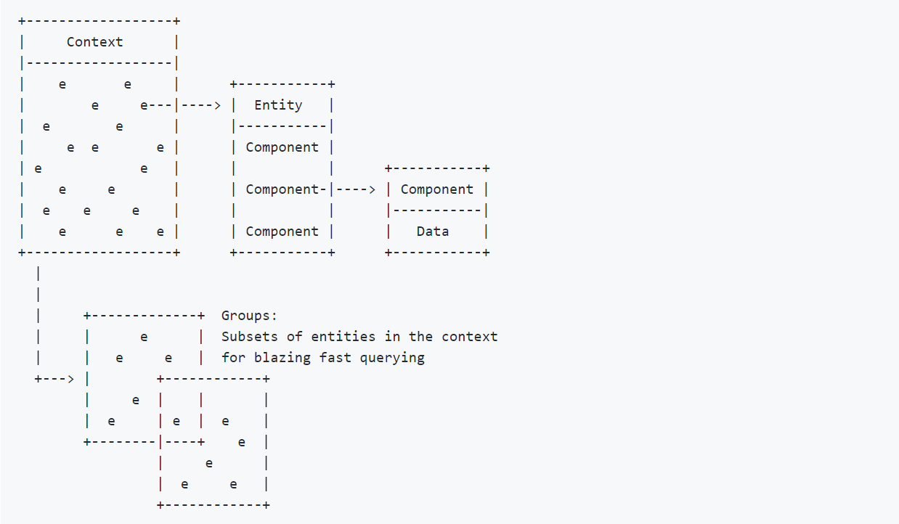
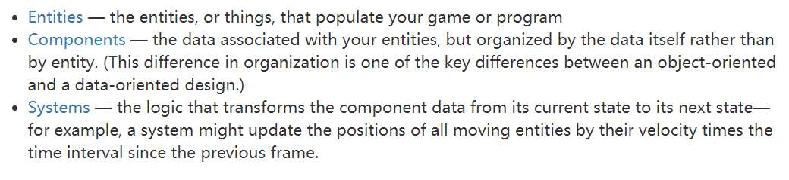

> 
ECS的基本使用和概念

[TOC]

##### ECS概述

ECS是一种设计思想，与传统OOP相对。传统OOP是抽象成逻辑上较为分离的对象，然后对象的属性property(或者field后文统一称为property)，能做出的行为function，对外部环境的相应other function，都放在对象内部，一般称为class。体现高内聚的设计模式思想，同时结合继承多态，OOP迅速成为主流的设计思想。归根到底是is a这样的抽象。

而ECS最开始是在overwatch的分享上提到的，进一步把对象也就是entity分隔，把其中的property称为component，这部分是纯数据，而function称为system，component和system是对应的，所以一个entity最后由不同的component组成，而这些component由对应的system关注并使用。ECS所以暗含数据驱动和组合的思想。是has a这样的抽象。所以ECS是has a也就是组合设计模式的一种具体体现。

那么居然已经有OOP了，为什么还需要有ECS呢？简单来说就是OOP要优雅的使用难度很大。首先是平凡的迭代的场景下，需要频繁的修改entity，以及里面的属性和方法。在继承链复杂的时候，为了维护较好的架构，数据需要不断的updown，即把“较为”公共的属性提升到父类，“特有”的保留在子类，这要又容易造成父类爆炸的情况。然后，继承链深度的控制，太深的继承链加多态性能的开销不可忽视。毕竟虚表和虚函数指针cache miss概率很大。

而ECS中，我们通过组合component来组装一个entity，所以频繁的修改会让我们聚焦到更小的集合，如一个system一个component，然后重新组装entity即可。和OOP同样无法避免的是继承问题，只能自我约束，一般ECS系统内部component之间是完全解耦的，不存在继承，同样entity不会通过继承来获得，而是通过组装component来构成一个entity的实体，理论上可能存在的entity类型是所有component的一个排列组合。当然实际落地的时候可以引入约束，比如某些component不能同时存在。

最后有一些cake，通过component来组装数据，同时按照职责对应component和system，execute某个system的行为时，筛选出所有的component，进行操作即可。所以可以在一个context(系统中)，我们可以全局的维护component的列表和缓存，entity只是持有component的引用，在system execute的时候，由于关注的component在内存中连续分布，所以缓存的命中率较高。而这在传统的OOP中，连续更新entity的属性，性能时较差的，因为entity含有很多的数据，我们连续访问entity中的字段是在不同的entity间跳跃的。

而Unity ECS则更进一步，利用多线程job system，以及native array减少甚至0 gc，同时结合brust编译器向量化指令能做到更极致的性能。

##### Entitas架构和使用

entitas的架构如上图，上面包含了核心的**context**，**entity**和**component**，加上**system**就构成了完整的entitas了。下面结合使用对其逐一讲解。

unity中配置好entitas环境后[5]，通过entitas的代码生成工具我们在contexts中添加需要生成的context，然后生成代码就会生成对应的context和entity，比如配置context Test，则会生成对应的TestAttribute，TestContext，TestEntity，TestMatcher，TestComponnetsLookup几个文件。他们的关系如下。

TestAttribute继承自C#的Attribute标签，最后会在meta中生成对应的数据标识相关类型，为entity生成的attribute在后面可以用来标识组成entity的component。代码生成的时候会把Test标签标识的component相关代码插入到entity中。注意该属性是sealed。

TestContext继承Context是entity的上层逻辑，维护所有该类型的entity，是一个entity的工厂，同时会对entity做cache。也会把上下文的改变通过回调通知到entity。Context中具有一个**ContextInfo**，其中记录了组成entity的component，string[]->type[]这样一个结构，简单来说就是记录了entity的一个template。通过Context调用factory function的(不通过cache创建一个entity)的时候，调用entity的Initialize时就需要把对应的contextInfo传递过去，在进行一些component操作的时候起到辅助的作用。同时context对component也有cache作用，在initialize的时候会把对应的IComponent(所有component需要实现的接口)stack传递过去，在entity内部进行add component时候都首先从对应的stack中进行，否则fallback到create，而删除或entity销毁的时候会把component都归还到stack中。生成代码中TestContext需要注册对应对应的工厂方法，ContextInfo，TotalComponents，StartIndex，以及AERC类即可。生成的context也是sealed的，但是是partial，留有扩展的空间。

TestEntity是生成的entity，继承自entitas中的entity，主要是给entity附加上entity的通用功能。这些通用功能基本都在IEntity结构中定义，如component的增删替换查询，生命周期方法，component变化的回调等等，内部还有entity所有component和index的查询缓存，同时entity具有唯一的一个标识create index，是context中内部递增的int值。同时entity还实现了IAREC接口，主要是维护context对entity的引用计数，具有SafeAERC和UnsafeAERC两种具体的实现，Unsafe直接对引用++--，而Safe会检查重复引用，如果保证Retain和Release成对调用的话就可以直接Unsafe，效率相对高一点。生成的TestEntity是一个sealed partial类，首先是生成一个继承entity的壳子，而与component相关的部分在生成component的时候一起成，我给Test配置了一个MoveComponent，在对应的TestMoveComponent中，生成了TestEntity的另外一部分。其中包含对move component相关的操作，如判断是否有这个component，获取这个component，Add，Replace，Remove等。注意每一个component都会生成entity的一个partial包含对对应的entitiy component的操作。

为了更安全和方便，为组成Entity的component生成了对应的常量，就在TestComponentsLookup中。就是Entity的template，前面提到的context info也是根据这里面的信息构造的，其中包含component index，total num，name array和type array。

最后还有一个TestMatcher类，也是分为两部分，一部分是随entity生成的，另一部分是伴随每个component生成的，会调用Matcher类里面的一些工具方法来辅助实现，其中主要有AllOf、AnyOf两个方法，返回对应的mather实例，然后传递给Context的GetGroup获取符合mather的entity(注：context中也含有GetEntities、HasEntity等方法，所有的entity是保存在HashSet中的)，context中会根据mather的hashcode对查询结果进行缓存，也就是一个dict，同时context会对entity的change、component replace等事件做出相应，保证group cache里数据的正确性。总的来说，Group是将Entity按照某种规则分类。再来看看Component生成的**Mather**，就是为每个Component生成一个对应的Macther。除了按照Group分组，还可以获取**Collector**，Collector相当于可以监听**Group**的变化。

component，终于轮到component了，component生成的partial entity和mather以及Lookup类前面都讲过了。component通过entity c#的activator反射工厂模式创建，也就是创建我们编写的类，然后直接访问和修改里面的属性。所以private属性不会生成对应代码。同时除了entity的标签，component还支持其他的标签类型[6]。

Contexts维护所有的context，也是外部交互的入口，有些辅助方法如PrimaryEntityIndex标识生成的方法就放在ContextsExtensions中，同时会生成PrimaryEntityIndex用来维护一个唯一映射的dict，同样EntityIndex维护一个key-hashset的结构，同时支持事件生成的方式来和外部系统通信。

system[7]，主要有5个不同的system接口(ReactiveSystem是通过继承来实现)，通过实现和组合这些接口实现需要的system。

5个接口分别是，IInitializeSystem，类似monobehaviour在lifetime中执行一次，可用于做一些初始化。IExecuteSytem类似update方法，每帧调用一次。ICleanupSystem在每帧的最后调用，类似OnEndOfTheFrame确保前面的逻辑都走完，这儿是保证execute system和reactive system执行完毕。ITearDownSystem，在程序退出前执行，类似OnAppliactionQuit做一些资源卸载工作等。ReactiveSystem用来监听Group的改变，筛选出component data改变的entity做出响应，同时需要绑定context，需要注意的是ReactiveSystem和ExecuteSystem是不能组合的。如果要对多个context做出响应可以使用MultiReactiveSystem，要让不同context下的entity有同样的抽象实现同样的接口，所以需要抽象出新的接口。最后Features给了我们一个组织system的抽象，我们可以按照不同的逻辑group system，不同的system会按照加入到systems中的顺序执行。但是system内部对component的操作不应该有互相依赖。

架构，真正做工程的时候，我们需要把entitas和unity对接起来，可以筛选出新建的entity然后创建对应的gameobject，通过扩展方法link和entity关联起来，然后通过event监听component的改变。另一个方式是抛弃gameobject，全部都在entitas中来做，如具有rendercomp，positioncomp，一个system关注object的创建并附加rendercomp，里面含有mesh、mat等，以及附加positioncomp里面持有变换矩阵，而另外一个system负责用comp的数据绘制object。注意如果通过event通信的话要把event生成的对应的system注册了，同时给entity附加上对应的component并且注册对应的listener来响应事件。

Debug，entitas能够在hierarchy和inspector中显示通过entitas创建的context，以及context下的entity，component，Group之类的信息，可用于debug。

**遗憾的是entitas并没有job或brust加速，但是用原生的c# ThreadPool做了一定的并行。同时没有native collector会有一定的gc，component也是class而不是struct。**

##### Unity ECS

Unity官方推出了面向数据的设计架构DOTS，Data-Oriented Tech Stack，其中的核心便是ECS。同时unity不断的精简runtime c++层，把很多逻辑和功能用c#和dots重写，更好的利用多核cpu的性能，并为承载AAA游戏的制作提供可能，dots还只是在初期阶段，远远称不上完善，虽然我们不用将整个游戏都用dots搭建，但是在一些特定的系统中使用dots会有极大的收获。

OK，unity中的ECS的概念上和entitas是一致的。但是，组织和一些术语上存在一定的区别。具体会从以下几个部分介绍：

- archetype，unity中把component的唯一组合，称为一个**archetype**。对一个entity add/remove component会改变entity的archetype。

  

- memory chunks，archetype确定了memory chunk的分配，entity的archetype确定了该entity的component所在的**chunk**，同一个archetype中所有的entity的component在同一个chunk list中，一个chunk满了，新建一个chunk添加到list中，并用来放置对应的component。对entity add/remove component会改变entity的archetype，同时也会把entity对应的component从chunk中移到另一个chunk中去。entity的component并不保证有序，比如后加入的entity的component一定在之前的entity的component后面，因为移除entity的时候，chunk会产生空洞，这个时候会用末尾的component填补空洞。

  

- entity query，查询指定components的entity只需要找到对应的archetype就行了，不需要每个entity去遍历。同样有指定component的匹配规则。如All、Any、None，返回一个chunk的列表，然后我们可以遍历chunk中的components，如**IJobChunk**，**IJobForEach**或者foreach。

- Jobs，可以通过job system利用多线程来并行化一些处理，ECS提供JobComponentSystem，IJobForEach，IJobChunk，IJobForEachWithEntity等。ECS job会用到**EntityQuery**对象，其中不仅包含对应的components，也定义了read-only，read-write访问标识，标识确定了job的处理，如read same data可以全部并行，而一个job write data，另一个read data，则只能顺序执行。对于这种顺序执行的jobs，需要通过**JobHandle**设置依赖。

- system organization，system通过两个维度组织，world和group，默认情况下ecs会创建一个default world并包含一些预定义的group，把所有的system初始化并加入到simulation group中。group也是system，所以我们可以组合嵌套的方式灵活的组织我们的system。可以定义system的更新顺序，如果不设定system就会以**确定的顺序**执行。

- ecs authoring，指出我们可以用gameobject+monobehaviour的方式构建我们的游戏，然后通过一个conversion system来把他们转换为entities。

接下来就是详细的介绍各个部分的相关功能：

Entity：持有component的index。

- entity有一个唯一ID，通过**EntityManager**管理一个world中的所有entity，也维护archetype并管理chunk属数据，archetype是一个EntityArchetype struct，可通过EntityArchetypes中的接口创建archetype。

- entity可以通过把scene中的gameobject convert构建，也可以在spawning system中创建，或者直接调用EntityManager.CreateEntity创建，创建出来的entity与EntityManager在同一个world中。具体的创建方式如下：

  

- add、remove component会改变entity的archetype并导致数据的移动，所以不能在Job中进行这些操作，需要把这些操作加入到EntityCommandBuffer中，在job执行完毕后再执行CommandBuffer。

- world持有一个EntityManager和**ComponentSystems**，我们可以根据功能划分多个world，如一个simulation(gameplay)+render world，进入play mode会创建一个默认的world并把system注册进去，我们也可以禁止默认world的生成：

  

Component：数据的抽象。

- component是实现对应接口的struct。具体有以下接口：

  

  不同的component会有不同的存储方式，如shared component和chunk component存储在chunk外，因为component的一个instance被chunk中所有的entity持有，同时可以在chunk外额外分配的dynamic buffer。

- general purpose component——IComponentData，其中不包含托管对象的引用，所有的数据在没有gc的chunk memory中。IComponentData适合per-entity的数据。

- shared component data——ISharedComponentData，提供archetype外另一种组织entity的方式，EntityManager会把具有同样shared value的entity放在一个chunk中，所以shared component可以让我们连续的处理类似的entity。注意频繁的使用shared component会导致chunk的利用率低下，因为有额外的chunk逻辑，也就是会为每个shared component data维护一个chunk，可以使用**Entity Debugger**来查看chunk利用率。shared component适合多个entity共享的数据，如mesh，mat等。

  - 拥有同样shared data的entity在一个chunk中，对应sharedcomponentdata的引用也是被chunk持有，而不是entity。
  - 可以使用EntityQuery.SetFilter迭代拥有特定ShardComponentData的entities。也可通过EntityManger.GetAllUniqueSharedComponents获取所有的SharedComponentData。
  - sharedcomponentdata是自动引用计数的，应当尽量少的修改sharedcomponentdata，内部会使用memcpy将chunk data拷贝到另一个chunk。

- system state component——SystemStateComponentData，可用来维护system内部的资源，

component，general purpose components，shared components(placed in the same chunk)，system state components，dynamic buffer components，chunk components。

system，component system，job component system，entity command buffer。

system update order，

accessing entity data，IJobForEach，IJobChunk，ForEach，Manual，EntityQuery

##### 引用

[1]https://zhuanlan.zhihu.com/p/78783892

[2]https://zhuanlan.zhihu.com/p/51289405

[3]https://docs.unity3d.com/Packages/com.unity.entities@0.1/manual/index.html

[4]https://github.com/sschmid/Entitas-CSharp/wiki/Overview

[5]https://blog.csdn.net/sun124608666/article/details/100105850

[6]https://github.com/sschmid/Entitas-CSharp/wiki/Attributes

[7]https://github.com/sschmid/Entitas-CSharp/wiki/Systems