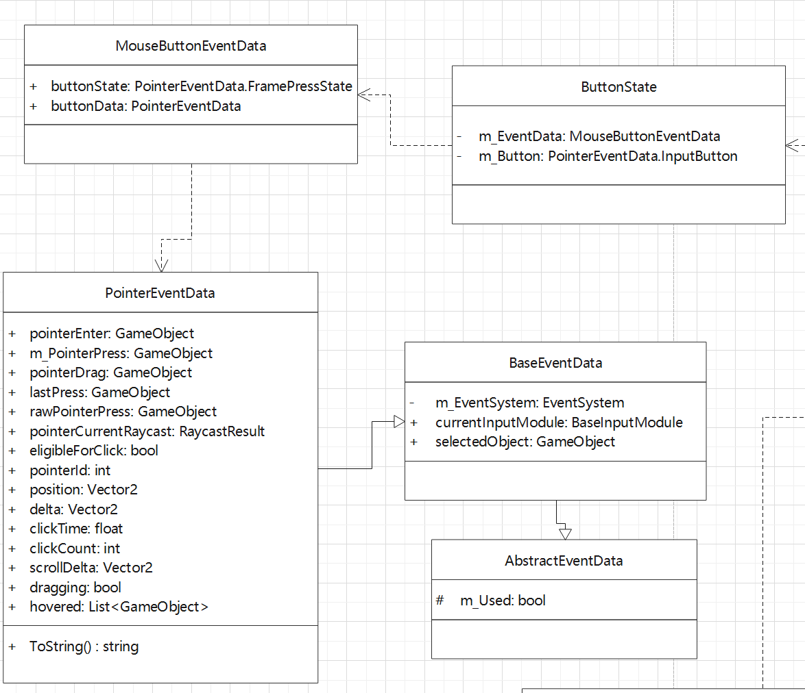

> <center><font face="黑体" size=32>EventSystem</font></center>

[TOC]

eventsystem负责提供ui事件响应的功能，进而使得ui能够对用户的输入做出反馈，完成交互和驱动组件状态的更新。

##### UIBehaviour

UIBehaviour继承自MonoBehaviour，扩展了一些ui组件专用的函数，如CanvasGroupChanged等。基本所有的ui组件都继承自该类。

```c#
protected virtual void OnRectTransformDimensionsChange(){}
protected virtual void OnBeforeTransformParentChanged(){}
protected virtual void OnTransformParentChanged(){}
protected virtual void OnDidApplyAnimationProperties(){}
protected virtual void OnCanvasGroupChanged(){}
protected virtual void OnCanvasHierarchyChanged(){}
```

##### EventSystem

```c#
	Handles input, raycasting, and sending events.
    The EventSystem is responsible for processing and handling events in a Unity scene. A scene should only contain one EventSystem. The EventSystem works in conjunction with a number of modules and mostly just holds state and delegates functionality to specific, overrideable components.
	When the EventSystem is started it searches for any BaseInputModules attached to the same GameObject and adds them to an internal list. On update each attached module receives an UpdateModules call, where the module can modify internal state. After each module has been Updated the active module has the Process call executed.This is where custom module processing can take place.
```

**注释中提到EventSystem负责处理输入、射线检测等，并且说明了一个场景应当只有一个EventSystem。并指出eventsystem和很多具有内部状态的模块一同协同工作，eventsystem运作的时候会把同gameobjefct下的BaseInputModule找出来，并用list维护起来，update的时候会同步UpdateModules，所有的modules都更新状态后会用当前active的module来process处理当前输入。**

这段注释把eventsystem的核心工作阐述得十分清楚。接下来就详细的看一看他的实现。

- BaseInputModule、EventSystem管理并驱动module更新和事件处理：通过list维护**BaseInputModule**列表，同时会记录一个当前处理事件的**m_CurrentInputModule**；

  ```c#
  private List<BaseInputModule> m_SystemInputModules = new List<BaseInputModule>();
  private BaseInputModule m_CurrentInputModule;
  ```

  在eventsystem update的时候会tick列表里BaseInputeModule的更新，同时会更新CurrInputModule把指向当前active并且support的module。如果找不到active&support，会fallback一个support的module，如果发生了处理modue的切换，当帧并不会触发对应的process；同时module切换的时候会调用对应的DeactivateModule和ActivateModule；

  ```c#
  protected virtual void Update()
  {
      //...
      TickModules();
      bool changedModule = false;
      for (var i = 0; i < m_SystemInputModules.Count; i++)
      {
          var module = m_SystemInputModules[i];
          if (module.IsModuleSupported() && module.ShouldActivateModule())
          {
              if (m_CurrentInputModule != module)
              {
                  ChangeEventModule(module);
                  changedModule = true;
              }
              break;
          }
      }
  
      // no event module set... set the first valid one...
      if (m_CurrentInputModule == null)
      {
          for (var i = 0; i < m_SystemInputModules.Count; i++)
          {
              var module = m_SystemInputModules[i];
              if (module.IsModuleSupported())
              {
                  ChangeEventModule(module);
                  changedModule = true;
                  break;
              }
          }
      }
  
      if (!changedModule && m_CurrentInputModule != null)
          m_CurrentInputModule.Process();
  }
  ```

  eventsystem还有一个管理游戏中所有eventsystem的功能，维护了一个EventSytem的静态列表；当每一个eventsystem脚本OnEnable和OnDisable都会对应的更新这个列表，换句话说，列表中维护了当前所有激活的EventSystem；同样也维护了一个current指代实际上会进行事件处理的eventsystem；eventsystem udpate的时候会判断如果自己不是current就不会进行实际的处理；所以说场景或游戏中可以有多个激活的EventSytem，但最终只会有一个起作用，但是如注释说的，还是希望一个场景只有一个EventSytem；

  ```c#
  private static List<EventSystem> m_EventSystems = new List<EventSystem>();
  
  public static EventSystem current
  {
      get { return m_EventSystems.Count > 0 ? m_EventSystems[0] : null; }
      set
      {
          int index = m_EventSystems.IndexOf(value);
  
          if (index >= 0)
          {
              m_EventSystems.RemoveAt(index);
              m_EventSystems.Insert(0, value);
          }
      }
  }
  ```

  ok，回到BaseInputModule，module list中的module是怎么添加的呢？首先假设场景中有一个eventsystem，他初始化后其他的BaseInputModule可以调用UpdateModules方法更新eventsystem的InputModule list；该方法会获取同一个节点下所有的BaseInputModule，并把active的加入到同样该节点下的eventsytem的inputmodule list中；

  ```c#
  public void UpdateModules()
  {
      GetComponents(m_SystemInputModules);
      for (int i = m_SystemInputModules.Count - 1; i >= 0; i--)
      {
          if (m_SystemInputModules[i] && m_SystemInputModules[i].IsActive())
              continue;
  
          m_SystemInputModules.RemoveAt(i);
      }
  }
  ```

  而该方法确实在BaseInputModule，OnEnable和OnDisable的时候会进行调用；同样只会同节点下的eventsystem进行更新，每个eventsytem都有自己唯一的inputmodule list；

  ```c#
  protected override void OnEnable()
  {
      base.OnEnable();
      m_EventSystem = GetComponent<EventSystem>();
      m_EventSystem.UpdateModules();
  }
  protected override void OnDisable()
  {
      m_EventSystem.UpdateModules();
      base.OnDisable();
  }
  ```

  BaseInputModule依赖于EventSytem，所以脚本有**[RequireComponent(typeof(EventSystem))]**标签。

- 射线检测：Raycast是在具体的InputModule调用process的时候，构造PointerEventData的时候会用到，如下；

  ```c#
  eventSystem.RaycastAll(leftData, m_RaycastResultCache);
  var raycast = FindFirstRaycast(m_RaycastResultCache);
  leftData.pointerCurrentRaycast = raycast;
  ```

  可以看到是调用了eventsystem中的**RaycastAll**函数，主要用来找到在鼠标点击位置处第一个探测到的合法的gameobject，从而完整的构造处PointerEventData，这在后面的部分会详细介绍到，而这个eventsystem就是同一个gameobject下的eventsytem；

  ```c#
  public void RaycastAll(PointerEventData eventData, List<RaycastResult> raycastResults)
  {
      raycastResults.Clear();
      var modules = RaycasterManager.GetRaycasters();
      for (int i = 0; i < modules.Count; ++i)
      {
          var module = modules[i];
          if (module == null || !module.IsActive())
              continue;
          module.Raycast(eventData, raycastResults);
      }
      raycastResults.Sort(s_RaycastComparer);
  }
  ```

  EventSytem完成raycast需要RaycasterManager的参与，其中管理着所有可以响应射线检测的BaseRaycaster集合；

  ```c#
  private static readonly List<BaseRaycaster> s_Raycasters = new List<BaseRaycaster>();
  ```

  首次看到**BaseRaycaster**可能有点陌生，后面会详细介绍，这儿我们简要的说明，所有可以响应射线检测的类都继承自BaseRaycaster，而其中一个子类**GraphicRaycaster**我们就很熟悉了，所有canvas节点中就会挂上这个组件，没有这个组件整个canvas包括下面的子节点就不能响应点击，并做出响应。同样在BaseRaycaster OnEnable和OnDisable的时候便会把自己添加到RaycasterManager中去。

  OK，EventSystem会拿到所有可以被射线检测的BaseRaycaster，依次调用每个Raycaster的**Raycast**方法，进行正真的检测。

  我们就先来看看对UI进行检测的GraphicRaycaster的Raycaste实现；

  ```c#
  Perform the raycast against the list of graphics associated with the Canvas.
  ```

  注释中也阐明了该函数的功能，对canvas下所有的**grahpics**进行射线检测，graphics又是一个比较复杂的概念，在ui core中我们会介绍，**简单来说graphics提供了渲染需要的mesh数据，而canvas renderer就是用graphics中的数据进行渲染的，凡是能看到的ui都直接或间接继承自graphics，如image、text**。

  OK，让我们回归正题，分析GraphicRaycaster中Raycast的实现；

  - 找到当前GraphicRaycaster对应的graphics列表；首先，需要在同一个节点下有对应的canvas；

    ```c#
    if (canvas == null)
        return;
    var canvasGraphics = GraphicRegistry.GetGraphicsForCanvas(canvas);
    if (canvasGraphics == null || canvasGraphics.Count == 0)
        return;
    ```

    可以看到在查询canvas下的graphics的时候，用到了**GraphicRegistry**，这是个单例类，其中主要记录了canvas到graphics集合的映射，也就是每个GraphicRaycaster对应的canvas下有哪些graphics；

    ```c#
    private readonly Dictionary<Canvas, IndexedSet<Graphic>> m_Graphics = new Dictionary<Canvas, IndexedSet<Graphic>>();
    ```

    可以看到graphic列表用了一个内置的数据结构IndexedSet保存；

    ```c#
    readonly List<T> m_List = new List<T>();
    Dictionary<T, int> m_Dictionary = new Dictionary<T, int>();
    ```

    用到了一个dict和list的组合来维护数据。ok，这儿啰嗦一下，基本的dict实现用object做hash，然后冲突用链表可能在极端情况下退化成链表，用数组并加上不同的冲突处理函数，会出现这样一种情况，比如数组长10，使用线性探测，2和12都映射到2，12向后线性探测找到3，而3来的时候由于slot3已经被占领，所以会再向后找，这样会有一个冲突累计，查找效率降低。在这样的情况下，lua就用了这样一种思想：**首先还是基于数组，但是冲突链会用next指针连接起来，找到object所应该在的slot，如果对应位置有数据，并且slot就是数据应该在的位置，而不是由于冲突才放到该位置的，就放到free slot，然后next指向free slot，如果对应位置不是数据应该在的为止，就会把数据移动到free slot，并修改prev next，然后把当前数据放到该位置，以此来降低冲突**。c**#中的dict或者hashset也是基于数组，但是更彻底，一个slot数组存放真正的数据，一个bucket数组存放hash值对应的slot id，和lua一样保证hash值一样的数据才会冲突，减短冲突链，可以看出比起lua，少了判断slot是不是object本应该在的位置，因为bucket数组的存在消除了这一步。**说了这么多，还是get不到为什么要设计这么一个数据结构，这个结构所具备的东西hashset或dict都能提供，唯一不能提供的是这个就够有一个sort功能，把list排序了然后重新映射m_Dictionary，我们知道hashet和dict不能保证访问的有序，要排序也只能copy出来排，这个IndexedSet代码中也被用来排序了，所以估计是这个考量。

    同样，在Graphic OnEnable和OnDisable的时候会通过GraphicRegistry把自己注册到对应的canvas的graphic列表中，找到的parent第一个active&enable的canvas。

  - 处理multiple display，unity的target display简单来说可以确定gameobject渲染到哪一个屏幕上，如果设备支持multiple display需要保证ui的dispaly target和点击到的屏幕的display target匹配才进行响应；

    ```c#
    if (canvas.renderMode == RenderMode.ScreenSpaceOverlay || currentEventCamera == null)
        displayIndex = canvas.targetDisplay;
    else
        displayIndex = currentEventCamera.targetDisplay;
    var eventPosition = Display.RelativeMouseAt(eventData.position);
    if (eventPosition != Vector3.zero)
    {
        int eventDisplayIndex = (int)eventPosition.z;
        if (eventDisplayIndex != displayIndex)
            return;
    }
    else
    {
        eventPosition = eventData.position;
    }
    ```

    可以看到根据rendermode，分别从canvas和camera中获取的target display，在multi display模式下如果displayIndex和点击的displayIndex不匹配就不会进行处理；

  - 计算view space下的pos，并预先过滤一遍；

    ```c#
    Vector2 pos;
    if (currentEventCamera == null)
    {
        float w = Screen.width;
        float h = Screen.height;
        if (displayIndex > 0 && displayIndex < Display.displays.Length)
        {
            w = Display.displays[displayIndex].systemWidth;
            h = Display.displays[displayIndex].systemHeight;
        }
        pos = new Vector2(eventPosition.x / w, eventPosition.y / h);
    }
    else
        pos = currentEventCamera.ScreenToViewportPoint(eventPosition);
    if (pos.x < 0f || pos.x > 1f || pos.y < 0f || pos.y > 1f)
        return;
    ```

    根据mode不同，分为用screen width和height以及使用camera viewport来计算view space pos两种方式；

  - 计算raycast的max distance；在非overlay模式下，ui不总是最后渲染的，所以可能被场景遮挡，所以这种情况下需要计算最先hit到的场景以表示最大的探测距离，如果graphic在在这个距离之外，就会过滤掉；

    ```c#
    Ray ray = new Ray();
    if (currentEventCamera != null)
        ray = currentEventCamera.ScreenPointToRay(eventPosition);
    
    if (canvas.renderMode != RenderMode.ScreenSpaceOverlay && blockingObjects != BlockingObjects.None)
    {
        float distanceToClipPlane = 100.0f;
        if (currentEventCamera != null)
        {
            float projectionDirection = ray.direction.z;
            distanceToClipPlane = Mathf.Approximately(0.0f, projectionDirection)
                ? Mathf.Infinity
                : Mathf.Abs((currentEventCamera.farClipPlane - currentEventCamera.nearClipPlane) / projectionDirection);
        }
    
        if (blockingObjects == BlockingObjects.ThreeD || blockingObjects == BlockingObjects.All)
        {
            if (ReflectionMethodsCache.Singleton.raycast3D != null)
            {
                var hits = ReflectionMethodsCache.Singleton.raycast3DAll(ray, distanceToClipPlane, (int)m_BlockingMask);
                if (hits.Length > 0)
                    hitDistance = hits[0].distance;
            }
        }
    
        if (blockingObjects == BlockingObjects.TwoD || blockingObjects == BlockingObjects.All)
        {
            if (ReflectionMethodsCache.Singleton.raycast2D != null)
            {
                var hits = ReflectionMethodsCache.Singleton.getRayIntersectionAll(ray, distanceToClipPlane, (int)m_BlockingMask);
                if (hits.Length > 0)
                    hitDistance = hits[0].distance;
            }
        }
    }
    ```

    先根据情况构造ray，然后在非overlay和设置了blocking object的情况下，更新hitDistance；分别对3D和2D物体进行raycast来找到第一个hit的object；最后调用的是Physics module中对应的Raycast方法，同时会把blocking mask传入用来指定参与检测的layer；

  - 对所有的graphics进行raycast；

    ```c#
    Raycast(canvas, currentEventCamera, eventPosition, canvasGraphics, m_RaycastResults);
    //implement
    int totalCount = foundGraphics.Count;
    for (int i = 0; i < totalCount; ++i)
    {
        Graphic graphic = foundGraphics[i];
        // -1 means it hasn't been processed by the canvas, which means it isn't actually drawn
        if (graphic.depth == -1 || !graphic.raycastTarget || graphic.canvasRenderer.cull)
            continue;
    
        if (!RectTransformUtility.RectangleContainsScreenPoint(graphic.rectTransform, pointerPosition, eventCamera))
            continue;
    
        if (eventCamera != null && eventCamera.WorldToScreenPoint(graphic.rectTransform.position).z > eventCamera.farClipPlane)
            continue;
        if (graphic.Raycast(pointerPosition, eventCamera))
            s_SortedGraphics.Add(graphic);
    }
    
    s_SortedGraphics.Sort((g1, g2) => g2.depth.CompareTo(g1.depth));
    totalCount = s_SortedGraphics.Count;
    for (int i = 0; i < totalCount; ++i)
        results.Add(s_SortedGraphics[i]);
    ```

    对graphics列表进行raycast的代码如上，预先过滤一遍，把depth为-1、raycastTarget没有勾选、rectTransform没有contain事件pos、以及有对应camera然后超出farclip plane的过滤掉，最后如果graphic的raycast通过便加入列表，根据**depth**按照从大到小排序后返回；

    **Graphic的Raycast**；检测一下active&enable，检测从自己到root或者overrideSorting的canvas的路途中会不会被过滤掉；

    ```c#
    while (t != null)
    {
        t.GetComponents(components);
        for (var i = 0; i < components.Count; i++)
        {
            var canvas = components[i] as Canvas;
            if (canvas != null && canvas.overrideSorting)
                continueTraversal = false;
    
            var filter = components[i] as ICanvasRaycastFilter;
    
            if (filter == null)
                continue;
    
            var raycastValid = true;
    
            var group = components[i] as CanvasGroup;
            if (group != null)
            {
                if (ignoreParentGroups == false && group.ignoreParentGroups)
                {
                    ignoreParentGroups = true;
                    raycastValid = filter.IsRaycastLocationValid(sp, eventCamera);
                }
                else if (!ignoreParentGroups)
                    raycastValid = filter.IsRaycastLocationValid(sp, eventCamera);
            }
            else
            {
                raycastValid = filter.IsRaycastLocationValid(sp, eventCamera);
            }
    
            if (!raycastValid)
            {
                ListPool<Component>.Release(components);
                return false;
            }
        }
        t = continueTraversal ? t.parent : null;
    }
    ```

    如上，主要是通过实现了**ICanvasRaycastFilter**的组件来判断是否过滤掉，实现该接口的有Image，Mask，RectMask2D；image是有额外的alpha判断，如果设置了最小的alpha，然后点击到贴图的alpha值小于阈值就会被过滤掉；mask是需要pos在自己的recttransform中，所以比如mask下面的button被mask了一部分看不到，自然也点击不到；reckmask2D同mask需要pos在自己的rect中，在graphic向上回溯的路径上都没有被过滤掉，就会被加入hit的列表中；

  - 根据距离筛选，最后就是把hit到的列表用最大hitDistance进行筛选；这儿会顺便把reversed graphics过滤掉；

    ```c#
    if (ignoreReversedGraphics)
    {
        if (currentEventCamera == null)
        {
            var dir = go.transform.rotation * Vector3.forward;
            appendGraphic = Vector3.Dot(Vector3.forward, dir) > 0;
        }
        else
        {
            var cameraFoward = currentEventCamera.transform.rotation * Vector3.forward;
            var dir = go.transform.rotation * Vector3.forward;
            appendGraphic = Vector3.Dot(cameraFoward, dir) > 0;
        }
    }
    ```

    构造RaycastResult；

    ```c#
    if (distance >= hitDistance)
        continue;
    var castResult = new RaycastResult
    {
        gameObject = go,
        module = this,
        distance = distance,
        screenPosition = eventPosition,
        index = resultAppendList.Count,
        depth = m_RaycastResults[index].depth,
        sortingLayer = canvas.sortingLayerID,
        sortingOrder = canvas.sortingOrder,
        worldPosition = ray.origin + ray.direction * distance,
        worldNormal = -transForward
    };
    resultAppendList.Add(castResult);
    ```

    而EventSystem中会把所有BaseRaycaster的hit结果合并然后，然后先根据module的sort order property和render order property进行排序，然后根据sortintLayer和sortingOrder排序，最后根据depth、distance和index排序。OK，最终结果便可供PointerInputModule构造PointerEventData相关数据。

- 缓存当前选中的物体与Debug，当对应的组件被选中时，也就是触发了对应的事件，可通过eventsystem的**SetSelectedGameObject**方法更新当前选中的gameobject，同时触发对应的ISelectHandler和IDeselectHandler事件。同时在eventsystem的tostring方法中也会把当前选中的gameobject打印出来方便调试，同时也会把current module的信息打印出来。

##### InputModules

InputModule是真正对用户输入进行处理的地方。主要包含EventData构造和Event Process两个部分。该部分的类图如下；


基类BaseInputModule；主要实现了把自己注册到对应的eventsystem中和从中注销的基本处理，以及维护了相应的EventSystem的引用，同时提供了一个处理Pointer Exit和Enter的基本实现**HandlePointerExitAndEnter**，更为关键的是其中定义了监听输入(构造输入)的对象**BaseInput**。

```c#
if (m_InputOverride != null)
    return m_InputOverride;
if (m_DefaultInput == null)
{
    var inputs = GetComponents<BaseInput>();
    foreach (var baseInput in inputs)
    {
        if (baseInput != null && baseInput.GetType() == typeof(BaseInput))
        {
            m_DefaultInput = baseInput;
            break;
        }
    }
    if (m_DefaultInput == null)
        m_DefaultInput = gameObject.AddComponent<BaseInput>();
}
return m_DefaultInput;
```

构造EventData的时候，需要的位置等信息都是从其中定义的input中获得，该input需要是BaseInput，或者我们也可以继承BaseInput override默认的input。**BaseInput就是对input的简单封装**。

PointerInputModule引入了对pointer数据和状态的维护；

```c#
protected Dictionary<int, PointerEventData> m_PointerData = new Dictionary<int, PointerEventData>();
private readonly MouseState m_MouseState = new MouseState();
```

**MouseState**我们在后面的EventData中详述，PointerInputModule要同步更新这些数据；

```c#
if (Cursor.lockState == CursorLockMode.Locked)
{
    leftData.position = new Vector2(-1.0f, -1.0f);
    leftData.delta = Vector2.zero;
}
else
{
    leftData.delta = pos - leftData.position;
    leftData.position = pos;
}
leftData.scrollDelta = input.mouseScrollDelta;
leftData.button = PointerEventData.InputButton.Left;
//...
leftData.pointerCurrentRaycast = raycast;
//...
CopyFromTo(leftData, rightData);
rightData.button = PointerEventData.InputButton.Right;
//...
CopyFromTo(leftData, middleData);
middleData.button = PointerEventData.InputButton.Middle;
//...
m_MouseState.SetButtonState(PointerEventData.InputButton.Left, StateForMouseButton(0), leftData);
//...
```

上面是构造Mouse相关的数据，如果是Touch则通过**GetTouchPointerEventData**来构造输入。此外，还定义了Move和Drag的处理；

```c#
protected virtual void ProcessMove(PointerEventData pointerEvent)
    //...
    HandlePointerExitAndEnter(pointerEvent, targetGO);
```

可以看到最终调用的就是BaseInputModule中的HandlePointerExitAndEnter，其中会调用**ExecuteEvents**在pointerEnter的gameobject的hierarchy上找到实现IPointerExitHandler的组件执行对应的OnPointerExit，以及在enter的gameobject的hierarchy上找到IPointerEnterHandler执行对应的OnPointerEnter。

```c#
protected virtual void ProcessDrag(PointerEventData pointerEvent)
{
    if (!pointerEvent.IsPointerMoving() ||
        Cursor.lockState == CursorLockMode.Locked ||
        pointerEvent.pointerDrag == null)
        return;
   //...
    if (pointerEvent.dragging)
    {
        if (pointerEvent.pointerPress != pointerEvent.pointerDrag)
        {
            ExecuteEvents.Execute(pointerEvent.pointerPress, pointerEvent, ExecuteEvents.pointerUpHandler);
            pointerEvent.eligibleForClick = false;
            pointerEvent.pointerPress = null;
            pointerEvent.rawPointerPress = null;
        }
        ExecuteEvents.Execute(pointerEvent.pointerDrag, pointerEvent, ExecuteEvents.dragHandler);
    }
}
```

而drag同样找到IDragHandler，只是有一些触发drag的条件需要满足。通过上面两个事件的处理，我们也发现PointerEventData需要维护一些事件发生当时的上下文，以供后续的事件处理用，如press gameobject，drag gameobject等等。

StandaloneInputModule重载了Process方法，也就是eventsystem驱动事件处理所调用的方法，此外TouchInputModule已经被弃用，现在Touch相关的事件也是通过StandaloneInputModule处理；

```c#
public override void Process()
{
    if (!eventSystem.isFocused && ShouldIgnoreEventsOnNoFocus())
        return;

    bool usedEvent = SendUpdateEventToSelectedObject();
    if (!ProcessTouchEvents() && input.mousePresent)
        ProcessMouseEvent();

    if (eventSystem.sendNavigationEvents)
    {
        if (!usedEvent)
            usedEvent |= SendMoveEventToSelectedObject();
        if (!usedEvent)
            SendSubmitEventToSelectedObject();
    }
}
```

首先是处理IUpdateSelectedHandler，然后处理Touch和Mouse event，最后进行Navigation Event的处理。

```c#
private bool ProcessTouchEvents()
{
    for (int i = 0; i < input.touchCount; ++i)
    {
        Touch touch = input.GetTouch(i);
        if (touch.type == TouchType.Indirect)
            continue;
        bool released;
        bool pressed;
        var pointer = GetTouchPointerEventData(touch, out pressed, out released);
        ProcessTouchPress(pointer, pressed, released);
        if (!released)
        {
            ProcessMove(pointer);
            ProcessDrag(pointer);
        }
        else
            RemovePointerData(pointer);
    }
    return input.touchCount > 0;
}
```

touch的处理，主要是遍历所有的touch并构建对应的PointerEventData，然后分别处理Press，Move，Drag，Remove。

**Press：**

```c#
pointerEvent.eligibleForClick = true;
pointerEvent.pointerPressRaycast = pointerEvent.pointerCurrentRaycast;
DeselectIfSelectionChanged(currentOverGo, pointerEvent);

if (pointerEvent.pointerEnter != currentOverGo)
{
    HandlePointerExitAndEnter(pointerEvent, currentOverGo);
    pointerEvent.pointerEnter = currentOverGo;
}

var newPressed = ExecuteEvents.ExecuteHierarchy(currentOverGo, pointerEvent, ExecuteEvents.pointerDownHandler);

if (newPressed == null)
    newPressed = ExecuteEvents.GetEventHandler<IPointerClickHandler>(currentOverGo);


float time = Time.unscaledTime;
if (newPressed == pointerEvent.lastPress)
{
    var diffTime = time - pointerEvent.clickTime;
    if (diffTime < 0.3f)
        ++pointerEvent.clickCount;
    else
        pointerEvent.clickCount = 1;

    pointerEvent.clickTime = time;
}
else
{
    pointerEvent.clickCount = 1;
}

pointerEvent.pointerPress = newPressed;
pointerEvent.rawPointerPress = currentOverGo;

pointerEvent.pointerDrag = ExecuteEvents.GetEventHandler<IDragHandler>(currentOverGo);

if (pointerEvent.pointerDrag != null)
    ExecuteEvents.Execute(pointerEvent.pointerDrag, pointerEvent, ExecuteEvents.initializePotentialDrag);
```

上面是处理Touch Press的代码片段，主要是进一步初始化PointerEventData，并附处理对应的Pointer Enter和Exit事件，以及从hierarchy中找到IPointerDownHandler处理Down事件，同时我们还要把press的gameobject记录在pointerPress里面，一遍后面release的时候调用click，所以没有找到IPointerDownHandler我们就要找对应的IPointerClickHandler记录下来，pointerPress中记录了处理press或click的gameobject，而raycast hit到的gameobject会放到rawPointerPress里面，同时找到IDragHandler并记录在pointerDrag，然后调用它实现的IInitializePotentialDragHandler。总的来说依次处理EnterExit->Press并记录(fallback到click)->drag(drag initial如果存在)，同时其中还会纪律clickCount。

```c#
ExecuteEvents.Execute(pointerEvent.pointerPress, pointerEvent, ExecuteEvents.pointerUpHandler);

var pointerUpHandler = ExecuteEvents.GetEventHandler<IPointerClickHandler>(currentOverGo);

if (pointerEvent.pointerPress == pointerUpHandler && pointerEvent.eligibleForClick)
    ExecuteEvents.Execute(pointerEvent.pointerPress, pointerEvent, ExecuteEvents.pointerClickHandler);
else if (pointerEvent.pointerDrag != null && pointerEvent.dragging)
    ExecuteEvents.ExecuteHierarchy(currentOverGo, pointerEvent, ExecuteEvents.dropHandler);

pointerEvent.eligibleForClick = false;
pointerEvent.pointerPress = null;
pointerEvent.rawPointerPress = null;

if (pointerEvent.pointerDrag != null && pointerEvent.dragging)
    ExecuteEvents.Execute(pointerEvent.pointerDrag, pointerEvent, ExecuteEvents.endDragHandler);

pointerEvent.dragging = false;
pointerEvent.pointerDrag = null;

ExecuteEvents.ExecuteHierarchy(pointerEvent.pointerEnter, pointerEvent, ExecuteEvents.pointerExitHandler);
pointerEvent.pointerEnter = null;
```

release相反，先处理IPointerUpHandler，然后判断pointerPress是不是记录的IPointerClickHandler gameobject，是的并且是一次合法的点击就执行对应的IPointerClickHandler，不是合法的点击并且如果是drag就执行IDropHandler，然后执行IEndDragHandler和IPointerExitHandler，最后清空PointerEventData。

**Move：**

move主要是调用HandlePointerExitAndEnter，从而进一步调用select object上对应的IPointerExitHandler、IPointerEnterHandler。

**Drag：**

```c#
protected virtual void ProcessDrag(PointerEventData pointerEvent)
{
    //...
    ExecuteEvents.Execute(pointerEvent.pointerDrag, pointerEvent, ExecuteEvents.beginDragHandler);
    pointerEvent.dragging = true;
    //...
    ExecuteEvents.Execute(pointerEvent.pointerDrag, pointerEvent, ExecuteEvents.dragHandler);
}
```

drag主要调用IBeginDragHandler和IDragHandler。

**Remove：**把对应的PointerEventData从记录的dict中移除。

然后是处理mouse事件，首先更新mouse state；通过调用PointerInputModule中的方法把leftData、rightData、middleData的数据和状态都同步到最新；

```c#
var mouseData = GetMousePointerEventData(id);
```

然后分别处理left、right、middle对应的事件；其中left依次Press、Move、Drag，right和middle著需要处理Press和Drag，最后还需要处理scroll事件。press、move、drag和touch的处理一致。scroll就是鼠标滚轮事件，对应IScrollHandler。

最后便是navigation event的处理，如果event system勾选了此选项，就会对相应的move、submit和cancel进行处理。该选项首先是代理move event，会把一些键盘事件转换成IMoveHandler处理，比如上下左右和wasd。而OnMove的具体实现在**Selectable**中。

```c#
case MoveDirection.Right:
Navigate(eventData, FindSelectableOnRight());
break;
//...
public virtual Selectable FindSelectableOnRight()
{
    if (m_Navigation.mode == Navigation.Mode.Explicit)
    {
        return m_Navigation.selectOnRight;
    }
    if ((m_Navigation.mode & Navigation.Mode.Horizontal) != 0)
    {
        return FindSelectable(transform.rotation * Vector3.right);
    }
    return null;
}
```

主要就是找到对应移动方向的下一个物体，然后设置为当前select的object。比如我们在下拉菜单里面可以通过上下建，切换选项。

然后是处理submit和cancel event；

```c#
protected bool SendSubmitEventToSelectedObject()
{
    if (eventSystem.currentSelectedGameObject == null)
        return false;

    var data = GetBaseEventData();
    if (input.GetButtonDown(m_SubmitButton))
        ExecuteEvents.Execute(eventSystem.currentSelectedGameObject, data, ExecuteEvents.submitHandler);

    if (input.GetButtonDown(m_CancelButton))
        ExecuteEvents.Execute(eventSystem.currentSelectedGameObject, data, ExecuteEvents.cancelHandler);
    return data.used;
}
```

调用ISubmitHandler、ICancelHandler的对应实现。

**OK，我们看到InputModule的职责是构建和维护输入数据，并通过ExecuteEvents触发对应的事件。**

##### EventData

前面提到在InputModule process事件的时候，会首先基于当前上下文构造EventData，更准确的来说是**MouseState**，PointerInputModule中维护着一个MouseState，以及一个m_PointerData字典存放当前的PointerEventData。OK，这里我们就来理一下这些数据的关系。



##### ExecuteEvents

前面说到input module通过ExecuteEvents来真正的触发对应的事件处理，现在就来看看事件执行模块的工作。ExecuteEvents是一个静态类，其中首先抽象了对所有event进行处理的delegate；

```c#
public delegate void EventFunction<T1>(T1 handler, BaseEventData eventData);
```

为每个事件都会创建一个对应的委托对象并暴露给外部；

```c#
private static readonly EventFunction<IPointerExitHandler> s_PointerExitHandler = Execute;

private static void Execute(IPointerExitHandler handler, BaseEventData eventData)
{
    handler.OnPointerExit(ValidateEventData<PointerEventData>(eventData));
}

public static EventFunction<IPointerExitHandler> pointerExitHandler
{
    get { return s_PointerExitHandler; }
}
```

外部一般是通过调用**Execute**方法进行指定gameobject上的事件处理；

```c#
public static bool Execute<T>(GameObject target, BaseEventData eventData, EventFunction<T> functor) where T : IEventSystemHandler
{
    var internalHandlers = s_HandlerListPool.Get();
    GetEventList<T>(target, internalHandlers);
    for (var i = 0; i < internalHandlers.Count; i++)
    {
        T arg;
        try
        {
            arg = (T)internalHandlers[i];
        }
        catch (Exception e)
        {
        }

        try
        {
            functor(arg, eventData);
        }
        catch (Exception e)
        {
        }
    }

    var handlerCount = internalHandlers.Count;
    s_HandlerListPool.Release(internalHandlers);
    return handlerCount > 0;
}
```

如上，传入对应的gameobject、eventdata和delegate，这里面主要是从gameobject上找到实现了对应事件接口T的component也就是arg，然后调用component对应的接口方法。

```c#
private static void GetEventList<T>(GameObject go, IList<IEventSystemHandler> results) where T : IEventSystemHandler
{
    var components = ListPool<Component>.Get();
    go.GetComponents(components);
    for (var i = 0; i < components.Count; i++)
    {
        if (!ShouldSendToComponent<T>(components[i]))
            continue;
        results.Add(components[i] as IEventSystemHandler);
    }
}
```

GetEventList就是用来查找gameobject上实现对应接口的component，具体是通过ShouldSendToComponent来进行过滤的；

```c#
private static bool ShouldSendToComponent<T>(Component component) where T : IEventSystemHandler
{
    var valid = component is T;
    if (!valid)
        return false;

    var behaviour = component as Behaviour;
    if (behaviour != null)
        return behaviour.isActiveAndEnabled;
    return true;
}
```

主要是看能不能转型为T，然后看是不是active&enable，这样便进入了具体ui组件的实现了，这在我们的ui component部分会提到，不同ui对事件的响应。

另一个方法是**ExecuteHierarchy**，主要是会从当前gameobject节点向上遍历整个hierarchy，直到找到成功issue掉event的gameobject，如pointerDownHandler就是通过ExeccuteHierarchy处理对应的事件。

```c#
public static GameObject ExecuteHierarchy<T>(GameObject root, BaseEventData eventData, EventFunction<T> callbackFunction) where T : IEventSystemHandler
{
    GetEventChain(root, s_InternalTransformList);

    for (var i = 0; i < s_InternalTransformList.Count; i++)
    {
        var transform = s_InternalTransformList[i];
        if (Execute(transform.gameObject, eventData, callbackFunction))
            return transform.gameObject;
    }
    return null;
}
```

而我们在处理click会查询hierarchy中第一个实现IPointerClickHandler的gameobject，并把它记录下来，在release的如果match的话就会调用click事件对应的实现，这是通过**GetEventHandler**获取的；

```c#
public static GameObject GetEventHandler<T>(GameObject root) where T : IEventSystemHandler
{
    if (root == null)
        return null;

    Transform t = root.transform;
    while (t != null)
    {
        if (CanHandleEvent<T>(t.gameObject))
            return t.gameObject;
        t = t.parent;
    }
    return null;
}
```

ok，ExecuteEvents差不多就介绍完了，接下来，我们看看和事件相关的接口有哪些。所有相关的接口都在EventInterfaces.cs里面，所有的接口都继承自IEventSystemHandler。虽然接口很多但是基本可以分为以下几类：enter/exit，down/up，click，initializdrag/begindrag/drag/enddrag，scroll，updateselect/select/deselect，move/submit/cancel，对应的接口如下。


ui component实现对应的接口，并且hit到的graphic上有该component或者向上冒泡到该component，就可以响应到对应的事件。除此之外，还有个EventTrigger提一下，如果gameobject上没有实现对应的接口的组件，可以添加一个EventTrigger，其中实现了所有的事件接口。其中维护了我们添加的triggers；

```c#
public List<Entry> triggers
{
    get
    {
        if (m_Delegates == null)
            m_Delegates = new List<Entry>();
        return m_Delegates;
    }
    set { m_Delegates = value; }
}
```

triggers是一个entry的列表，Entry记录一个EventTriggerType eventID到callback的映射，比如执行OnPointerEnter事件；

```c#
public virtual void OnPointerEnter(PointerEventData eventData)
{
    Execute(EventTriggerType.PointerEnter, eventData);
}
private void Execute(EventTriggerType id, BaseEventData eventData)
{
    for (int i = 0, imax = triggers.Count; i < imax; ++i)
    {
        var ent = triggers[i];
        if (ent.eventID == id && ent.callback != null)
            ent.callback.Invoke(eventData);
    }
}
```

##### Raycasters

前面提到RaycasterManager中维护了所有的BaseRaycaster，并介绍了ui用的GraphicRaycaster，其主要是执行graphics的raycast。此外，PhysicsRaycaster也继承了BaseRaycaster，Physics2DRaycaster继承了PhysicsRaycaster，下面简单介绍一下这两个Raycaster。

- PhysicsRaycaster，主要是对3D物体进行raycast，3D空间下ray的构造需要camera，如果没有设定camera就会使用main camera，同时raycast的时候会结合eventmask以及camera的cullingmask进行过滤。并且同时支持有gc和nongc两种模式：

  ```c#
  if (m_MaxRayIntersections == 0)
  {
      if (ReflectionMethodsCache.Singleton.raycast3DAll == null)
          return;
      m_Hits = ReflectionMethodsCache.Singleton.raycast3DAll(ray, distanceToClipPlane, finalEventMask);
      hitCount = m_Hits.Length;
  }
  else
  {
      if (ReflectionMethodsCache.Singleton.getRaycastNonAlloc == null)
          return;
      if (m_LastMaxRayIntersections != m_MaxRayIntersections)
      {
          m_Hits = new RaycastHit[m_MaxRayIntersections];
          m_LastMaxRayIntersections = m_MaxRayIntersections;
      }
      hitCount = ReflectionMethodsCache.Singleton.getRaycastNonAlloc(ray, m_Hits, distanceToClipPlane, finalEventMask);
  }
  ```

- Physics2DRaycaster继承自PhysicsRaycaster，只是重写了Raycast方法，并且调用的是2D版本的raycast；

  ```c#
  m_Hits = ReflectionMethodsCache.Singleton.getRayIntersectionAll(ray, distanceToClipPlane, finalEventMask);
  ```

  最后的raycast结果会进行排序，不同的module之间的object会根据camera的depth来排，如果都有camera的情况下，像overlay的ui，distance为0，一定是会排在最前面的。

**总结：总的来说eventsystem是unity的事件系统，不仅包括ui也包括3d物体的事件交互都由它处理。其中包括，eventsystem、inputmodule、raycaster，eventexcute等关键模块。**


