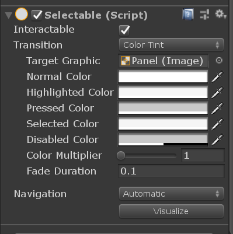
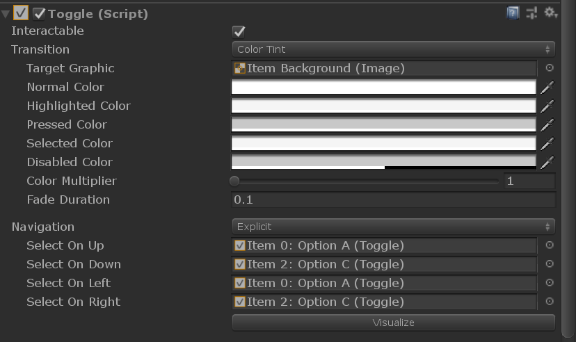
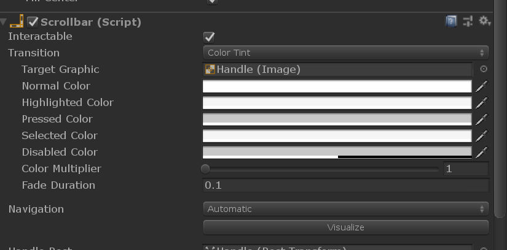

> <center><font face="黑体" size=32>UI</font></center>

[TOC]

UI组件部分代码比较多，但是游戏中UI常见的性能问题，如rebuild、relayout也发生在这，所以是比较重要的一部分。内容将分为以下几部分，core component，layout、cull、interface、rebuild、relayout。

##### Core Component

- Selectable，如字面意思selectable提供了基本的交互功能。

  

  Inspector面板上有上面类容的组件都是继承自selectable，在此基础上进行自定义的功能扩展。Selectable实现了**IMoveHandler, IPointerDownHandler,  IPointerUpHandler, IPointerEnterHandler,  IPointerExitHandler, ISelectHandler,  IDeselectHandler**几个接口。所以具备对enter/exit，down/up，select/deselect以及navigation move事件的基本响应。

  move事件，实现IMoveHandler中的OnMove方法，以支持我们之前提到的navigation事件，也就是对上下左右、wasd键进行响应。

  ```c#
  public virtual void OnMove(AxisEventData eventData)
  {
      switch (eventData.moveDir)
      {
          case MoveDirection.Right:
              Navigate(eventData, FindSelectableOnRight());
              break;
              ...
      }
  }
  
  void Navigate(AxisEventData eventData, Selectable sel)
  {
      if (sel != null && sel.IsActive())
          eventData.selectedObject = sel.gameObject;
  }
  ```

  根据dir选择对应的selectable，然后把它设置为当前选中的selectedObject。选择对应的方向的selectable方式要视navigation的模式而定。如选择右边的selectable。

  ```c#
  public virtual Selectable FindSelectableOnRight()
  {
      if (m_Navigation.mode == Navigation.Mode.Explicit)
      {
          return m_Navigation.selectOnRight;
      }
      if ((m_Navigation.mode & Navigation.Mode.Horizontal) != 0)
      {
          return FindSelectable(transform.rotation * Vector3.right);
      }
      return null;
  }
  ```

  如果被精确指定也就是Explicit模式，就会取出设置的selectable。如Dropdown里面的每个Toggle都会设置为该模式，并在下拉框显示的时候进行初始化设置每个方向的selectable，如Right和Down方向设置为列表中的下一个selectable，而Left和Up方向设置为列表中的上一个selectable。

  

  而scrollbar的navigation就是Automatic需要调用FindSelectable来查找合适的selectable，这儿需要所有的selectable信息，所以selectable中维护了一个当前所有激活的selectable列表。

  

  ```c#
  private static Selectable[] s_Selectables = new Selectable[10];
  ```

  选取的规则是，两个selectable的方向向量要和查询方向一致，同时在方向上的投影应该尽可能的长，最后选取的是score最大的selectable。

  ```c#
  float dot = Vector3.Dot(dir, myVector);
  if (dot <= 0)
      continue;
  float score = dot / myVector.sqrMagnitude;
  ```

  PointerDown、PointerUp、PointerEnter、PointerExit、Select、Deselect事件，都是设置selectable的状态，并进行相应表现。维护了一个当前状态。

  ```c#
  protected SelectionState currentSelectionState
  {
      get
      {
          if (!IsInteractable())
              return SelectionState.Disabled;
          if (isPointerDown)
              return SelectionState.Pressed;
          if (hasSelection)
              return SelectionState.Selected;
          if (isPointerInside)
              return SelectionState.Highlighted;
          return SelectionState.Normal;
      }
  }
  ```

  以及相应的转换函数。

  ```c#
  switch (state)
  {
      case SelectionState.Normal:
          tintColor = m_Colors.normalColor;
          transitionSprite = null;
          triggerName = m_AnimationTriggers.normalTrigger;
          break;
      case SelectionState.Highlighted:
          tintColor = m_Colors.highlightedColor;
          transitionSprite = m_SpriteState.highlightedSprite;
          triggerName = m_AnimationTriggers.highlightedTrigger;
          break;
      case SelectionState.Pressed:
          tintColor = m_Colors.pressedColor;
          transitionSprite = m_SpriteState.pressedSprite;
          triggerName = m_AnimationTriggers.pressedTrigger;
          break;
      case SelectionState.Selected:
          tintColor = m_Colors.selectedColor;
          transitionSprite = m_SpriteState.selectedSprite;
          triggerName = m_AnimationTriggers.selectedTrigger;
          break;
      case SelectionState.Disabled:
          tintColor = m_Colors.disabledColor;
          transitionSprite = m_SpriteState.disabledSprite;
          triggerName = m_AnimationTriggers.disabledTrigger;
          break;
      default:
          tintColor = Color.black;
          transitionSprite = null;
          triggerName = string.Empty;
          break;
  }
  
  switch (m_Transition)
  {
      case Transition.ColorTint:
          StartColorTween(tintColor * m_Colors.colorMultiplier, instant);
          break;
      case Transition.SpriteSwap:
          DoSpriteSwap(transitionSprite);
          break;
      case Transition.Animation:
          TriggerAnimation(triggerName);
          break;
  }
  ```

  selectable支持3种转换方式，基于color、sprite、animation。color和sprite都需要基于selectable gameobject上面的Graphic或Image来做切换，sprite是直接切，color有一个切换的过程，而animation需要有Animator组件并设置上面对应的trigger。color的切换支持一个过渡时间，通过graphic中的**CrossFadeColor**进行。

  ```c#
  var colorTween = new ColorTween {duration = duration, startColor = canvasRenderer.GetColor(), targetColor = targetColor};
  colorTween.AddOnChangedCallback(canvasRenderer.SetColor);
  colorTween.ignoreTimeScale = ignoreTimeScale;
  colorTween.tweenMode = mode;
  m_ColorTweenRunner.StartTween(colorTween);
  ```

  构造了一个ColorTween结构，然后用ColorTweenRunner来run。TweenRunner是基于当前graphic构建的run tween动画的类，内部用当前monobehaviour通过协程的方式来驱动动画。

  ```c#
  internal class TweenRunner<T> where T : struct, ITweenValue{}
  internal struct ColorTween : ITweenValue{}
  internal struct FloatTween : ITweenValue{}
  ```

  继承自selectable的有以下组件：InputField、Toggle、Button、Dropdown、Slider、Scrollbar。

- Graphic，之前提到过graphic提供给CanvasRenderer所需的mesh数据，Graphic+CanvasRenderer类似，Mesh Filter+Mesh Renderer的关系。遗憾是的没有**Canvas**和**CanvasRenderer**的源码。graphic不能直接添加到gameobject因为这是个抽象类，实现它的类MaskableGraphic也是个抽象类，但是**Image、Text、RawImage**都继承自MaskableGraphic，所以他们都具备Graphic提供的Material和Raycast功能，以及MaskableGraphic提供的可以被cull掉。

  其中包含公用的defaultMaterial和default的whiteTexture，以及用来辅助mesh构建的workerMesh。

  ```c#
  public virtual Material material
  {
      get
      {
          return (m_Material != null) ? m_Material : defaultMaterial;
      }
  }
  
  protected static Mesh workerMesh
  {
      get
      {
          if (s_Mesh == null)
          {
              s_Mesh = new Mesh();
              s_Mesh.name = "Shared UI Mesh";
              s_Mesh.hideFlags = HideFlags.HideAndDontSave;
          }
          return s_Mesh;
      }
  }
  ```

  OnEnable中需要把graphic注册到GraphicRegistry中以供raycast使用，同时会SetAllDirty。

  ```c#
  protected override void OnEnable()
  {
      GraphicRegistry.RegisterGraphicForCanvas(canvas, this);
      SetAllDirty();
  }
  ```

  

- 

##### Layout

- ILayoutElement、ILayoutController、ILayoutGroup、ILayoutSelfController、ILayoutIgnorer、LayoutGroup、LayoutRebuilder。

##### Cull

##### Interface

##### Rebuild

##### Relayout