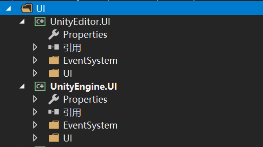
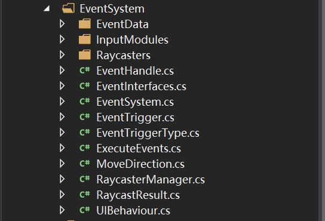
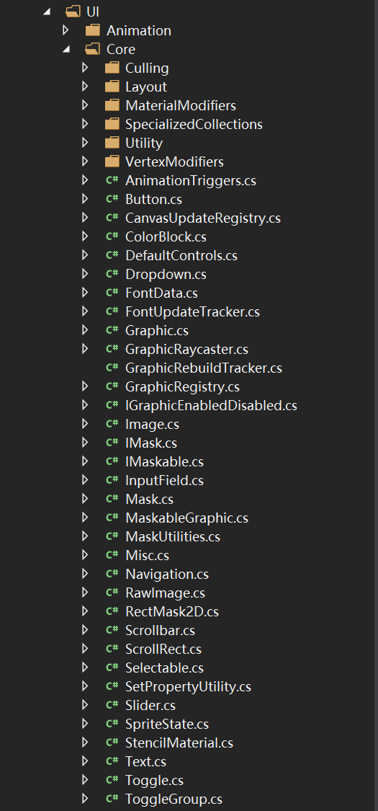

> 
UGUI总览

[TOC]

提示：源码版本2019.1。

##### 项目结构

分为editor和ui component部分，而ui有两部分构成，第一部分是事件相关的**EventSystem**，第二部分是对应的ui组件。

##### EventSystem

eventsystem负责捕获和封装用户操作，然后进行射线检测，触发检测到的ui组件，然后ui组件进行相应的响应。

##### UI

UI组件部分代码较多，核心是Core中的组件，包括Layout、Cull、Graphic等关键内容。